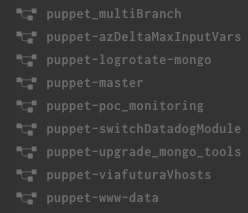

# Feature environments

At this moment it's not yet possible to handle feature environments or as Concourse calls it: `Spaces` per default in Concourse. Concourse is working hard towards having Spaces available out of the box, but that will require some time.

With this documentation we give an example on how you can have a similar experience with Concourse right now.

## How it works

So the idea is that once there is a new branch on git a new pipeline gets created in Concourse and once the branch is deleted the pipeline and everything behind it gets cleaned up.

In order to do this you can create the following job in a new pipeline:

### pipeline.yml

In this pipeline we invoke the `create-pipeline.yml` part and pass the puppet repository as an input in the `Create_pipelines` job.

```yaml
resource_types:
- name: git-branches
  type: docker-image
  source:
    repository: vito/git-branches-resource
resources:
  # Git repos
  - name: puppet
    type: git-branches
    source:
      uri: git@github.com:skyscrapers/puppet.git
      private_key: ((GIT_PRIVATE_KEY))
  - name: ci-git
    type: git
    icon: github-circle
    source:
      uri: git@github.com:skyscrapers/ci.git
      branch: master
      private_key: ((GIT_PRIVATE_KEY))
jobs:
  - name: "Create_pipelines"
    public: false
    plan:
    - in_parallel:
      - get: puppet
        trigger: true
      - get: ci-git
        trigger: true
    - task: Create pipelines
      file: ci-git/puppet_multiBranch/create-pipeline.yml
      params:
        CONCOURSE_PASSWORD: ((CONCOURSE_PASSWORD))
```

### create-pipeline.yml

```yaml
---

platform: linux

image_resource:
  type: docker-image
  source:
    repository: skyscrapers/fly
    tag: latest
inputs:
  - name: puppet
  - name: ci-git
outputs:
  - name: output
params:
  CONCOURSE_PASSWORD:
run:
  path: ci-git/puppet_multiBranch/create-pipeline.sh
```

### create-pipeline.sh

In this script we first collect the branches from the puppet repository as variables `NEW_VERSIONS` and `OLD_VERSIONS`. after that we login into Concourse and we create pipelines based on the `pipeline-puppet.tmpl`. For all the deleted branches we clean up the pipeline and execute any extra steps that are needed to clean up the environment.

```bash
#!/bin/sh

export NEW_VERSIONS=$(cat puppet/branches)
export OLD_VERSIONS=$(cat puppet/removed)

fly login -t skyscrapers --team-name skyscrapers -c https://ci.example.com -u -p $CONCOURSE_PASSWORD
fly -t skyscrapers sync
fly login -t skyscrapers --team-name skyscrapers -c https://ci.example.com -u -p $CONCOURSE_PASSWORD

for version in $NEW_VERSIONS; do
  sed "s/___BRANCH___/$version/g" ci-git/puppet_multiBranch/pipeline-puppet.tmpl > ./pipeline-puppet.result
  echo "Create pipeline branch $version"
  fly -t skyscrapers set-pipeline -n -p puppet-$version -c ./pipeline-puppet.result
  echo "Unpause pipeline branch $version"
  fly -t skyscrapers up -p puppet-$version
done

for version in $OLD_VERSIONS; do
  echo "Delete pipeline branch $version"
  fly -t skyscrapers destroy-pipeline -n -p puppet-$version
  # Add extra cleanup steps here as required
  # for example: kubectl delete namespace -n <namespace> --all
done
```

### pipeline-puppet.tmpl

This file contains the template of the pipeline that needs to be created for the feature environments.
As branch we set `___BRANCH___` wich will be replaced by the `create-pipeline.sh` script during the deploy of this pipeline.

```yaml
---
resources:
  - name: puppet-repo
    type: git
    icon: github-circle
    source:
      uri: git@github.com:skyscrapers/puppet.git
      branch: ___BRANCH___
      private_key: ((GIT_PRIVATE_KEY))
jobs:
  - name: test
    plan:
      - do:
        - get: puppet-repo
          trigger: true
        - task: notification
          file: puppet-repo/ci/notification.yml
        - task: lint
          file: puppet-repo/ci/lint.yml
```

## result



## sources

- [Multi git branches workflow with Concourse-CI](https://blog.alterway.fr/en/multi-git-branches-workflow-with-concourse-ci.html)
- [Concourse roadmap towards v10](https://blog.concourse-ci.org/core-roadmap-towards-v10/)
- [Concourse GH project with progress on Spaces](https://github.com/concourse/concourse/projects/2)
