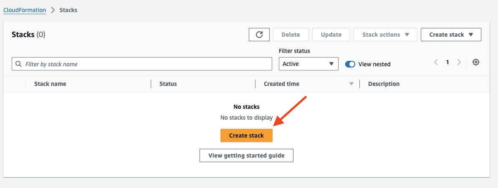
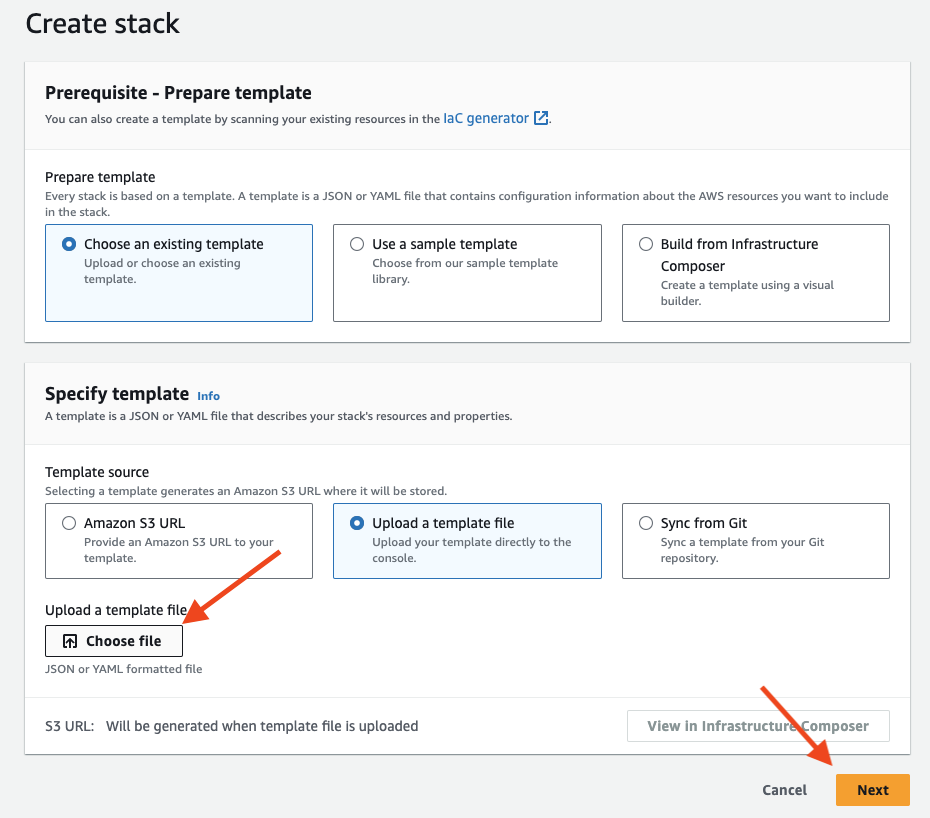
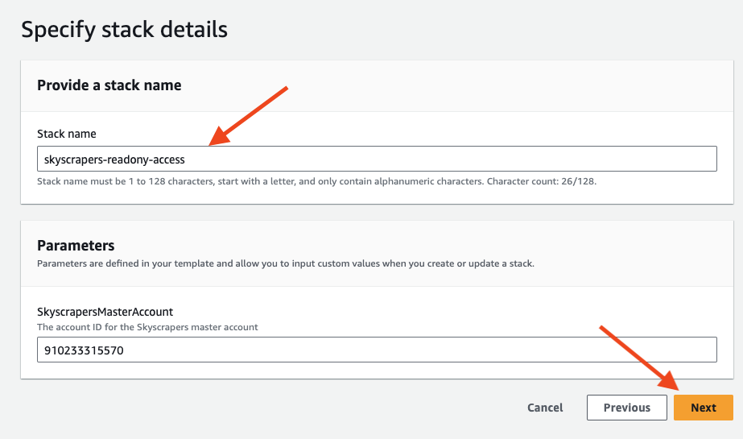
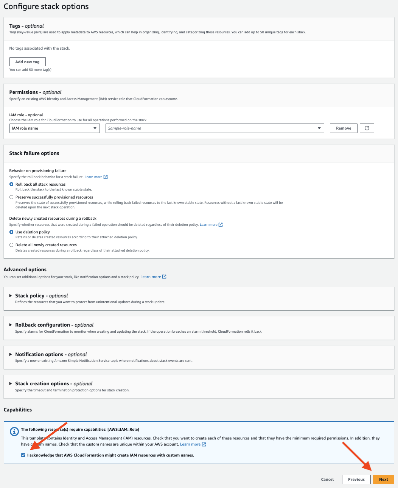
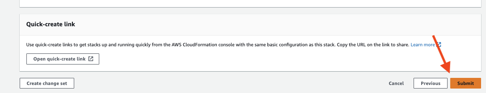
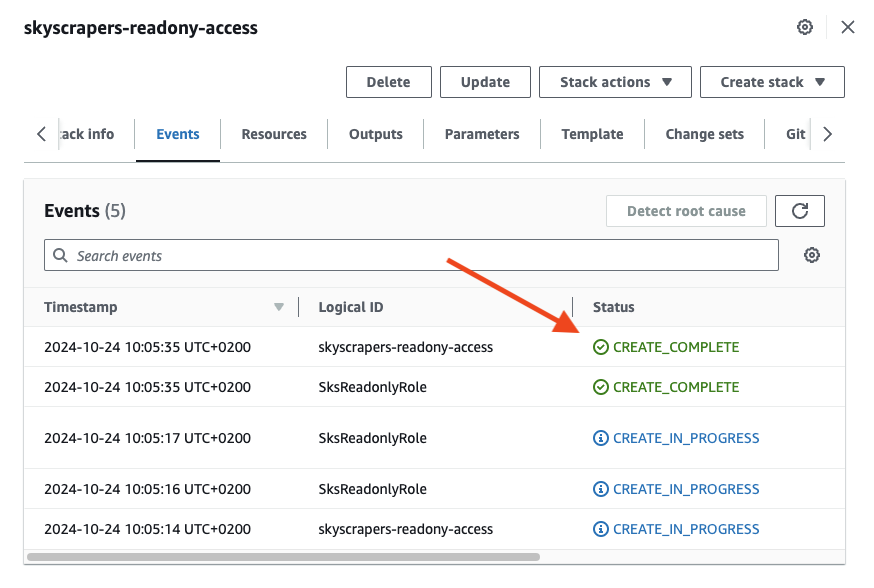

# How to provide Skyscrapers access to your AWS account

## Overview

In order to provide Skyscrapers with access to your AWS account(s), you can use this documentation to configure your accounts with the necessary permissions and trust relationship towards Skyscrapers. This will allow Skyscrapers engineers to assume these roles and perform the necessary tasks in your account.

The following roles can be created:

- The [ReadOnly IAM role](./cloudformation_templates/sks_ro.yml) gets deployed with the `ReadOnlyAccess` policy. This allows Skyscrapers engineers to obtain read-only access in the AWS account. This role is useful for monitoring, auditing, and troubleshooting purposes.
- [Admin IAM role](./cloudformation_templates/sks_admin.yml) gets deployed with the `AdministratorAccess` policy. This allows Skyscrapers engineers to obtain full access in the AWS account. This role is useful for performing administrative tasks, such as creating, modifying, and deleting resources.

This guide will walk you through the steps to create an ReadOnly and Admin IAM role in your AWS account through CloudFormation.

## Prerequisites

- You must have an AWS account with sufficient permissions to create IAM roles and apply CloudFormation stacks.
- Familiarity with CloudFormation and AWS IAM concepts is recommended but not required.

## Steps to Apply the Template

1. **Download the CloudFormation Template**

Download the CloudFormation YAML template file(s) you want to apply using the following link or copy the content below:

- [ReadOnly IAM role](./cloudformation_templates/sks_ro.yml)
- [Admin IAM role](./cloudformation_templates/sks_admin.yml)

### 3. **Deploy the Template via the AWS Management Console**

> [!NOTE]
> If you encounter any issues or have questions, please contact the Skyscrapers support team for assistance.

1. Log in to the [AWS Management Console](https://aws.amazon.com/console/).
2. Navigate to **CloudFormation** using the search bar or [click here](https://eu-west-1.console.aws.amazon.com/cloudformation/home).
   - 
3. Click **Create stack** and select **With new resources (standard)**.
4. In the **Create Stack** page:
   - Choose **Upload a template file** and upload the downloaded YAML file.
   - Click **Next**.
   - 
5. Provide a **Stack Name** (e.g., `Skyscrapers-Readonly-Access`).
   - 
6. Click **Next** to proceed.
7. Under **Configure stack options**, you can add stack-level tags if desired.
   - 
8. Click **Next**.
9. Review your stack configuration, and check the box acknowledging the creation of IAM resources.
   - 
10. Click **Create stack** to start the deployment.
11. Verify the deployment status in the CloudFormation console.
   - 

Once the deployment is complete, navigate to the **CloudFormation** console and ensure that the status of your stack shows **CREATE_COMPLETE**.

To verify the created role:

1. Go to the **IAM Console**.
2. Under **Roles**, find the role named `sks-readonly` and/or `sks-admin`.
3. Review the trust relationship and the attached policies to ensure everything is set up correctly.

## Updating or Deleting the Stack

- To **update** the stack, you can re-upload a modified version of the template in the CloudFormation console and choose **Update Stack**.
- To **delete** the stack, navigate to the CloudFormation console, select the stack, and click **Delete**.
