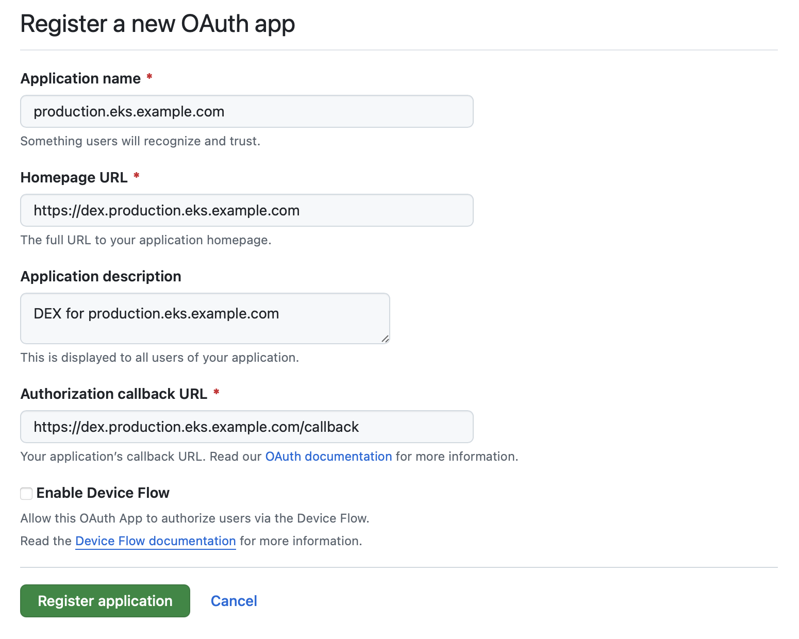
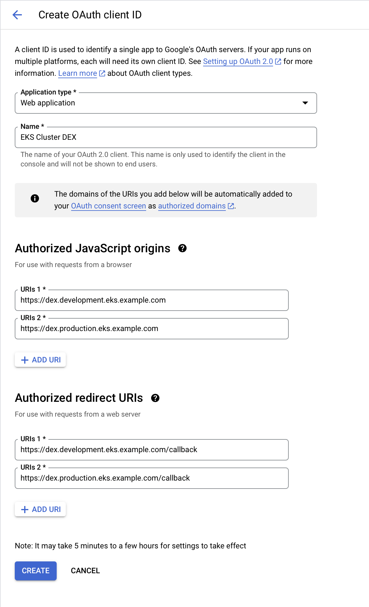
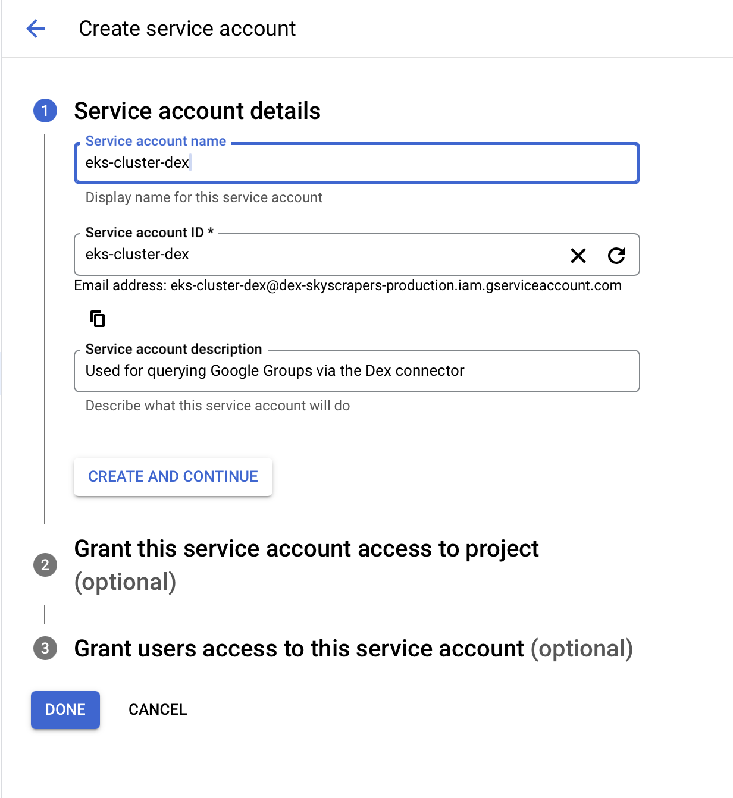
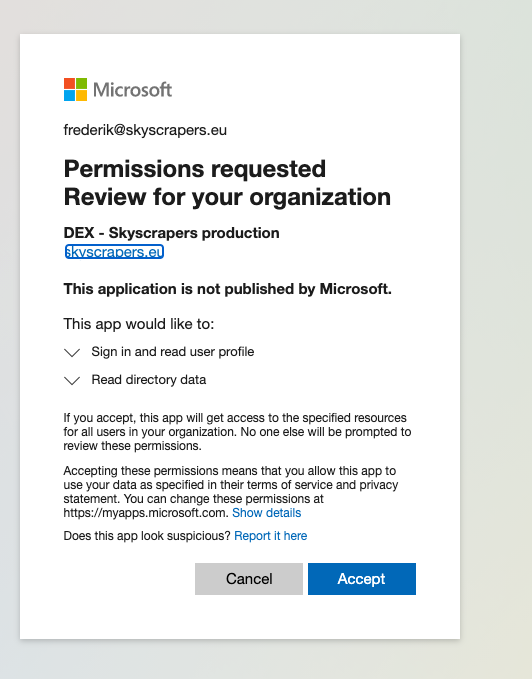

# Authentication

- [Authentication](#authentication)
  - [Accessing the EKS Kubernetes cluster (AWS IAM)](#accessing-the-eks-kubernetes-cluster-aws-iam)
  - [Accessing our various dashboards (Dex)](#accessing-our-various-dashboards-dex)
    - [GitHub](#github)
    - [Google](#google)
    - [Microsoft Azure (Entra ID)](#microsoft-azure-entra-id)

## Accessing the EKS Kubernetes cluster (AWS IAM)

> [!NOTE]
> More specific instructions how to access your platform are provided in your customer-specific documentation repository.

To gain access to an EKS cluster you need to authenticate via AWS IAM and configure your kubeconfig accordingly. To do this you'll need a recent version of `awscli` (preferably v2+). If you don't have the AWS CLI yet, you can install it by [following the AWS instructions](https://docs.aws.amazon.com/cli/latest/userguide/getting-started-install.html) or via [Homebrew](https://brew.sh/):

```bash
brew install awscli
```

You'll first need to authenticate to the AWS account where the EKS cluster is deployed. Depending on how you configured your `awscli` config, `--region` and `--profile` are optional.

Make sure to replace `<my_assumed_role_arn>` with a correct role depending on your access level. Which roles you can assume are documented in your customer-specific documentation.

```bash
aws eks update-kubeconfig --name <cluster_name> --alias <my_alias> [--role-arn <my_assumed_role_arn>] [--region <aws_region>] [--profile <my_aws_profile>]

# For example:
aws eks update-kubeconfig --name production-eks-example-com --alias production --role-arn arn:aws:iam::123456789012:role/developer
```

## Accessing our various dashboards (Dex)

We use [Dex](https://dexidp.io/) to provide authentication to our monitoring dashboards[^1]. Dex is a federated OpenID Connect (OIDC) provider that can be configured to use integrate and combine several other Identity Providers (IdP), such as Google, GitHub, Microsoft, etc. The configuration of Dex is specific for each cluster, and is currently managed by Skyscrapers, although integration details need to be provided by you (the customer).

A list of all available connectors and their documentation can be found [on the Dex site](https://dexidp.io/docs/connectors/).

[^1]: In combination with [OAuth2-Proxy](https://oauth2-proxy.github.io/oauth2-proxy/) for software that doesn't support OIDC out of the box (eg. Prometheus). You can integrate this same feature [in your own internal applications](/kubernetes/README.md#add-authentication-with-oauth2_proxy).

### GitHub

> [!NOTE]
> [Dex documentation for the GitHub connector](https://dexidp.io/docs/connectors/github/)

You, the customer, will need to register a new OAuth app in your GitHub Organization via the URL `https://github.com/organizations/<my_org>/settings/applications/new` (replace `<my_org>`). You can reach the same page via the GitHub settings for your Organization, under `Developer settings` -> `OAuth Apps` -> `New OAuth App`. Fill in the form following the below example, making sure to use the correct values for your cluster. You will need to to setup a new OAuth app per EKS cluster (development, production, ...).

The most important field is the Authorization callback URL, which you should fill in with the correct URL for your cluster provided by Skyscrapers (eg. `https://dex.production.eks.example.com/callback`).



After you've created the OAuth app, you'll get a `Client ID` but not yet a `Client Secret`. Click the `Generate a new client secret` button to get the `Client Secret`.

On Skyscrapers side, we will need the following information from you, to be sent over a secure channel like [Keybase](https://keybase.io):

- The `Client ID` and `Client Secret` of the GitHub OAuth application
- Which GitHub Organization and Team(s) to allow access

We will then configure the Dex connector of your cluster, as follows:

```yaml
- name: CustomerName
  id: customername
  type: github
  config:
    clientID: <client_id>
    clientSecret: <client_secret>
    redirectURI: https://dex.production.eks.example.com/callback
    orgs:
      - name: my_github_org
        teams:
          - my_github_team
```

### Google

> [!NOTE]
> [Dex documentation for the Google connector](https://dexidp.io/docs/connectors/google/)

You, the customer, will need to register a new OAuth 2.0 Client ID in the Google Cloud dashboard via the URL <https://console.cloud.google.com/apis/credentials>. Click the `CREATE CREDENTIALS` button -> `OAuth client ID` and choose `Web application` in the dropdown. Fill in the form following the below example, making sure to use the correct values for your cluster(s). You can use the same OAuth app for all your clusters, or use a separate one per EKS cluster (development, production, ...).

Make sure to configure the `Authorized JavaScript origins` and `Authorized redirect URIs` with the URIs provided by Skyscrapers (eg. `https://dex.production.eks.example.com` and `https://dex.production.eks.example.com/callback`).



After you've created the OAuth app, you'll get a `Client ID` and a `Client Secret`. Make sure to take not of those (though you can also consult them again later).

If you want to provide access to your whole Google Workspace domain, you can stop here. However, if you want to limit access based on Groups, you should follow the next steps to create and configure a Service Account.

In the [same Google Cloud Credentials dashboard as before](https://console.cloud.google.com/apis/credentials), click the `CREATE CREDENTIALS` button again, but choose `Service account` now. Give it **only** a name and a description, and click `DONE`. Next 



Next open the newly created Service account, go to the `KEYS` tab and click the `ADD KEY` -> `Create new key` button. Choose `JSON` as Key type and click `CREATE`. This will download a JSON file to your computer. This file contains the private key of the service account, and should be kept secure.

Next, go back to the `DETAILS` tab of the Service account, and click open `Advanced settings`. We will [setup Domain-wide Delegation](https://developers.google.com/workspace/guides/create-credentials#optional_set_up_domain-wide_delegation_for_a_service_account), so make a copy of the `Client ID`[^2] and click on the `VIEW GOOGLE WORKSPACE ADMIN CONSOLE` button below it. In the new window/tab, go to `Security` -> `Access and data control` -> `API controls`. Click `MANAGE DOMAIN WIDE DELEGATION` button and next `Add new`. In the prompt, insert the Service account's `Client ID` you copied earlier and as OAuth scope use `https://www.googleapis.com/auth/admin.directory.group.readonly`. Click `AUTHORIZE`.

Finally, you need to enable the [Admin SDK API](https://console.developers.google.com/apis/library/admin.googleapis.com/). Just go to the linked page and cvlick the `ENABLE` button.

On Skyscrapers side, we will need the following information from you, to be sent over a secure channel like [Keybase](https://keybase.io):

- The `Client ID` and `Client Secret` of the Google OAuth application(s) you created
- Your Google Workspace domain
- Optional:
  - Which Groups to allow access in the form of their email addresses
  - The Service account JSON file you downloaded earlier
  - The email address of a user that has access to the Google Workspace Admin Console, or at has at least the `Groups Reader (BETA)` role assigned (probably you who followed all these steps :))

We will then configure the Dex connector of your cluster, as follows:

```yaml
- name: CustomerName
  id: customername
  type: google
  config:
    clientID: <client_id>
    clientSecret: <client_secret>
    redirectURI: https://dex.production.eks.example.com/callback
    hostedDomains:
      - example.com
    # Below config is optional when using groups:
    groups:
      - myteam@example.com
    serviceAccountFilePath: /etc/dex-data/googleAuth.json
    domainToAdminEmail:
      example.com: admin@example.com
```

For the `domainToAdminEmail` configuration, we need to specify the email address of a user that has permissions to read Google Groups. This user will be impersonated through the Service account to list all the available Groups in the domain. You could use the user that provided the Oauth and Service account credentials for this, or a separate user with the `Groups Reader (BETA)` assigned.

And when limiting access to groups, we also need to inject the service account JSON file into the Dex container:

```yaml
spec:
  dex:
    connectors_payload: <the_above_config_but_kms_encrypted>
    files:
      - name: googleAuth.json
        payload: <the_service_account_json_content_but_kms_encrypted>
```

[^2]: This is the Client ID of the Service account, not the one from the OAuth app we created earlier.

### Microsoft Azure (Entra ID)

> [!NOTE]
> [Dex documentation for the Microsoft connector](https://dexidp.io/docs/connectors/microsoft/)

You, the customer, will need need to register a new application in your Azure tenant. To do so, go to the Azure Entra ID portal for the correct tenant, then go to `App registrations` in the side bar and click the `New registration` button. You can give it the name you want, something significant like `DEX - <cluster name>`. Make sure to select `Accounts in this organizational directory only (skyscrapers.eu only - Single tenant)` as supported account type and configure the correct Redirect URI provided by Skyscrapers (eg. `https://dex.production.eks.example.com/callback`). The platform for this URI is `Web`.

Once the application is created, you'll need to create a client secret by going to `Certificates & secrets` in the side bar and clicking the `New client secret` button. Make sure to give an expiration date far into the future or we'll need to rotate this. Take note of the generated `Value` as it will only be shown once!

On Skyscrapers side, we will need the following information from you, to be sent over a secure channel like [Keybase](https://keybase.io):

- Application (client) ID
- Client secret Value
- Your tenant UUID (`915460cf-e41a-4d01-b1ac-0b1b9b6545ce`) or name (`example.onmicrosoft.com`)
- The list of groups to authorize in Dex. Users belonging to these groups will be granted access.

We will then configure the Dex connector of your cluster, as follows:

```yaml
- name: CustomerName
  id: customername
  type: microsoft
  config:
    clientID: <client_id>
    clientSecret: <client_secret>
    redirectURI: https://dex.production.eks.example.com/callback
    tenant: example.onmicrosoft.com
    groups:
      - my_group
```

In some cases, you might need to give the application special Admin consent so Dex is able to list groups on behalf of the logged in user. If that is the case, you'll need to add an explicit `Directory.Read.All` permission to the list of `Delegated Permissions` and then open the following link in your browser and log in under organization administrator account: `https://login.microsoftonline.com/<tenant>/adminconsent?client_id=<dex client id>`. You'll get a page similar to this one:



> [!NOTE]
> after you click `Accept` and grant the necessary permissions, you might get an error page from Dex. That's ok and you can ignore it and close it.
