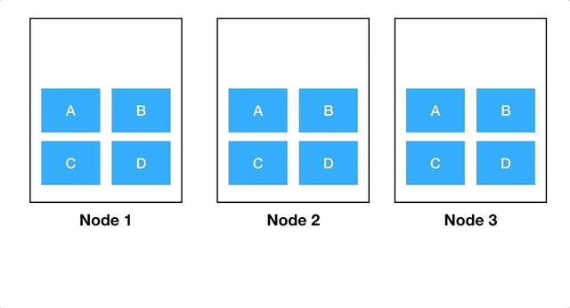

# Cluster balancing

Normally the Kubernetes scheduler will try to spread the replicas of your application across different nodes, to increase availability and resilience. But there might be cases where the scheduler is forced to place multiple Pods of the same application to a single node, either because there aren't enough available resources in the cluster to take a different approach, or because some other priorities take preference in the scheduling decision.

Because of this, it can happen that over time, and after nodes come and go, your cluster becomes unbalanced, where multiple (or all) Pods of your application are running on a single node, and other nodes in the cluster are underutilized. There's [a great blog post](https://itnext.io/keep-you-kubernetes-cluster-balanced-the-secret-to-high-availability-17edf60d9cb7) that goes over this topic, and the example scenario depicted in there is specially interesting.

This GIF perfectly describes such scenario ([extracted from the mentioned blog post](https://itnext.io/keep-you-kubernetes-cluster-balanced-the-secret-to-high-availability-17edf60d9cb7)):



For obvious reasons, having an unbalanced cluster is not ideal. If all replicas of your application are running on a single node, and that node goes down for any reason, your application will be unavailable until new Pods are scheduled on other nodes.

**Note** that voluntary disruptions like cluster rolling updates can be avoided [by implementing `PodDisruptionBudgets`](./pod_disruptions.md), but involuntary disruptions on the other hand will affect your application availability if your cluster is unbalanced.

## Possible solutions

### Add more resources to the cluster

Either add more nodes to the cluster or use bigger instances. In general, if there's more room in the cluster, the scheduler will be able to make better scheduling decisions and the replicas of your applications are more likely to be spread across different nodes.

**Note 1:** while this is not a direct solution to the problem, it will increase the chances of having a better balanced cluster.

**Note 2:** this will also increase infrastructure costs and it won't always be an option.

### Use Pod affinity and anti-affinity

Use [Pod affinity and anti-affinity](https://kubernetes.io/docs/concepts/configuration/assign-pod-node/#affinity-and-anti-affinity) to force the scheduler to spread your replicas across different nodes.

> There are currently two types of node affinity, called `requiredDuringSchedulingIgnoredDuringExecution` and `preferredDuringSchedulingIgnoredDuringExecution`. You can think of them as “hard” and “soft” respectively, in the sense that the former specifies rules that must be met for a pod to be scheduled onto a node (just like `nodeSelector` but using a more expressive syntax), while the latter specifies preferences that the scheduler will try to enforce but will not guarantee.

An example of using this method:

```yaml
spec:
  affinity:
    podAntiAffinity:
      preferredDuringSchedulingIgnoredDuringExecution:
      - podAffinityTerm:
          labelSelector:
            matchExpressions:
            - key: app
              operator: In
              values:
              - someapp
          topologyKey: kubernetes.io/hostname
        weight: 100
```

Take into account that if you use `requiredDuringSchedulingIgnoredDuringExecution`, you risk your Pods not being scheduled at all if the scheduler can't meet your requirements. On the other hand, if you use `preferredDuringSchedulingIgnoredDuringExecution` it's possible that your replicas end up running in a single node in any case, if the scheduler doesn't have any other option.

### Using Descheduler

[Descheduler for Kubernetes](https://github.com/kubernetes-incubator/descheduler) uses a sort of chaos engineering approach to evict Pods from nodes, so they are scheduled on "better suited" nodes, keeping the cluster balanced.

**Note** that this isn't a Kubernetes standard component, it's a standalone tool that must be run somewhere, normally in the same cluster.

**Disclaimer**: we don't have any experience with this tool, and we can't make any assurances on how it'll behave with your Kubernetes cluster. This situation might change in the future, but for now use it at your own risk.

## Related topics

- [Pod Disruptions](./pod_disruptions.md)
