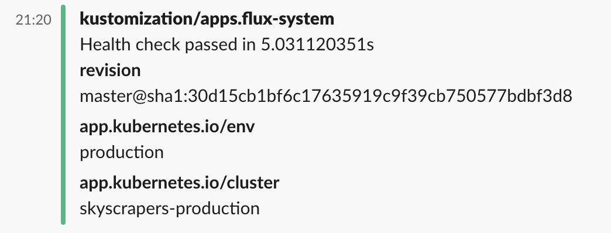

# Flux

> [!NOTE]
> Primary audience: Skyscrapers customers, Skyscrapers internal

## Introduction

[Flux](https://fluxcd.io/) is a way to deploy and maintain your applications and components through [GitOps](https://www.gitops.tech/#what-is-gitops). It is designed to keep your Kubernetes clusters in sync based on the configuration in git and to automate updates to configuration when Flux detects it. This documentation provides guidance on setting up and managing your repository structure using Flux in the cooperation with Skyscrapers.

In short, this means Flux will pull your changes from Git and keep everything reconciled. For example if you commit a neww container image to your helm chart, Flux will detect this and perform a helm upgrade directly from within the Kubernetes cluster. You are also not limited to Helm, Flux works great with Kustomize too.

- [Flux](#flux)
  - [Introduction](#introduction)
  - [Initial setup](#initial-setup)
  - [Repository Structure](#repository-structure)
    - [Directory Breakdown](#directory-breakdown)
    - [Applications](#applications)
  - [Example Configuration](#example-configuration)
    - [kustomization.yaml](#kustomizationyaml)
    - [apps.yaml](#appsyaml)
      - [External repository](#external-repository)
      - [Internal within the same repository](#internal-within-the-same-repository)
  - [Monitoring](#monitoring)
    - [Slack Alerts](#slack-alerts)
    - [Grafana Dashboards](#grafana-dashboards)
      - [Flux Cluster Stats](#flux-cluster-stats)
      - [Flux Control Plane](#flux-control-plane)
  - [ECR access](#ecr-access)

> [!IMPORTANT]
> Internally we are also migrating to use FLux for managing platform components. This means that in the near future Flux will be enabled out of the box for every customer/cluster. If you have any questions, please reach out to us.

## Initial setup

If you think this could be useful for your team, get in touch with us so we can offer you guidance and training on how to leverage it for your use-case.

Once the initial bootstrap is done, you can start managing your applications and infrastructure using Flux.

## Repository Structure

You will find the following structure for organizing Flux configurations and related resources in the repository:

```bash
docs/
flux/
├── apps/
    ├── base/
    ├── production/
    └── staging/
└── system/
    ├── production-cluster-name/
        ├── .../...
        └── DO_NOT_EDIT
    └── staging-cluster-name/
        ├── .../...
        └── DO_NOT_EDIT
└── clusters/
    ├── production-cluster-name/
        ├── flux-system/...
        ├── apps.yaml
        └── system.yaml
    └── staging-cluster-name/
        ├── flux-system/...
        ├── apps.yaml
        └── system.yaml
k8s-clusters/
├── production-cluster-name.yaml
└── staging-cluster-name.yaml
terraform/
├── live/
└── modules/
```

We recommend to use your own repository for managing your application manifests (`apps/`). **Reach out to us** for getting you started.

> [!IMPORTANT]
> The `flux/clusters` and `flux/system` directories are managed by Skyscrapers automation and you **SHOULD NOT** edit any files in these directories. Any change to these files can have unintended consequences and may break the cluster setup. We are looking into ways to better protect these files from accidental changes.

### Directory Breakdown

**flux/**: Directory to hold all Flux-related configuration files.

- **apps/**: Optional directory to organize application configurations.
  - **base/**: Base configurations for all environments.
  - **production/**: Specific configurations for the production environment.
  - **staging/**: Specific configurations for the staging environment.
- **system/**: Directory for managing platform configurations. **DO NOT EDIT!**.
- **clusters/**: Directory for managing cluster-specific configurations.
  - **production-cluster-name/**: Configuration for the production cluster.
    - **flux-system/**: Contains the core Flux system configurations. This is automatically provisioned for you by Skyscrapers/Flux and can't be modified manually.
    - **apps.yaml**: Kustomization overlay pointing to the apps folder or repository. See [Applications section](#applications) for more information.
  - **staging-cluster-name/**: Configuration for the staging cluster, structured similarly to the production cluster.

### Applications

To allow for more flexibility for your applications, we recommend to use a separate repository to store your manifests instead of the IaC repository (`skyscrapers/<customer_name>`). Reach out to us to properly configure the `apps.yaml` Kustomization for facilitating this. This way you can still manage your application manifests within your own git repository, while still having Flux deploy them. The only requirement for this is that you define a `GitRepository` and create a Secret in the `flux-apps` namespace with an [SSH deploy key](https://docs.github.com/en/authentication/connecting-to-github-with-ssh/managing-deploy-keys#deploy-keys) to access the repository. Example:

```yaml
---
apiVersion: source.toolkit.fluxcd.io/v1
kind: GitRepository
metadata:
  name: my-apps
  namespace: flux-apps
spec:
  interval: 1m0s
  ref:
    branch: main
  secretRef:
    name: apps-deploykey
  url: ssh://git@github.com/<organisation>/<repo-name>.git
```

## Example Configuration

This section provides some examples of the configuration files used to manage Flux resources. For a more in depth explanation of the configuration files, please refer to the [Flux documentation](https://fluxcd.io/docs/) and reach out to us.

> [!NOTE]
> In general, please reach out to us for guidance on getting started with Flux. It's important to take great care, as we use the same system for managing the cluster state and platform components.

### kustomization.yaml

The `kustomization.yaml` file is used to manage resources in a structured way. In this file you refer to all files that you want Kustomize to include. An example configuration might look like:

```yaml
apiVersion: kustomize.config.k8s.io/v1beta1
kind: Kustomization
resources:
  - deployment.yaml
  - monitoring.yaml
  - scaling.yaml
```

### apps.yaml

This file points to the applications folder or repository, allowing Flux to manage application deployments. An example configuration might be:

#### External repository

```yaml
apiVersion: source.toolkit.fluxcd.io/v1
kind: GitRepository
metadata:
  name: app
  namespace: flux-apps
spec:
  url: ssh://git@github.com/<organisation>/<repo-name>.git
  ref:
    branch: main
  secretRef:
    name: apps-deploykey
---
apiVersion: kustomize.toolkit.fluxcd.io/v1
kind: Kustomization
metadata:
  name: app-production
  namespace: flux-apps
spec:
  sourceRef:
    kind: GitRepository
    name: app
  path: flux/apps/production
```

> [!IMPORTANT]
> Requirement for this is that a secret (called `apps-deploykey` here in this example) is deployed in the `flux-apps` namespace with an [SSH deploy key](https://docs.github.com/en/authentication/connecting-to-github-with-ssh/managing-deploy-keys#deploy-keys) to access the repository.

#### Internal within the same repository

> [!IMPORTANT]
> This is not recommended, but can be used as a temporary solution / PoC.

```yaml
apiVersion: kustomize.toolkit.fluxcd.io/v1
kind: Kustomization
metadata:
  name: apps-propduction
  namespace: flux-apps
spec:
  interval: 10m
  path: ./flux/apps/production
  sourceRef:
    kind: GitRepository
    name: flux-system
```

## Monitoring

### Slack Alerts

Out of the box Flux alerts in the shared Slack channel for errors.
The destination channel and severity can be configured to your liking. Please reach out to us if you want to change the configuration or add more alerts.



### Grafana Dashboards

There are 2 Grafana dashboards available in your Grafana for monitoring Flux:

#### Flux Cluster Stats

This dashboard provides an overview on the overall status of all objects managed by Flux.


#### Flux Control Plane

This dashboard provides an overview of the Flux system components and their health status.


## ECR access

> [!NOTE]
> Primary audience: Skyscrapers internal

If AWS ECR is used as registry, Skyscrapers commonly needs to setup cross-account access to ECR repositories. Instructions can be found in the [AWS ECR documentation](/aws/ecr.md#setup-cross-account-ecr-access).
