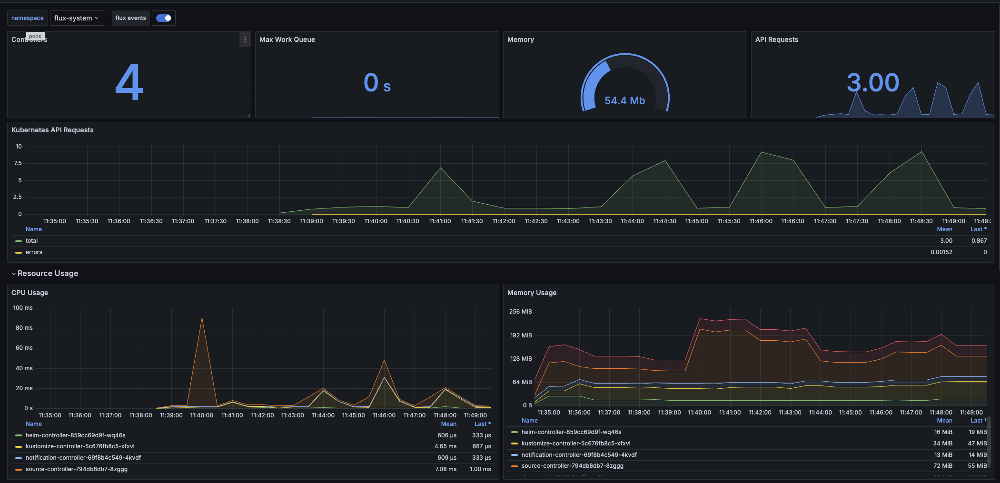

# Flux at Skyscrapers – Internal Training & Documentation

> **Note:**
> This guide is intended for Skyscrapers engineers (mixed experience levels) to understand how Flux is used in our platform. It covers how Flux works, how to debug common issues, and how to deploy changes using Flux. It also highlights our internal tooling (OpenTofu and Concourse CI) used to bootstrap and manage Flux.

- [Flux at Skyscrapers – Internal Training \& Documentation](#flux-at-skyscrapers--internal-training--documentation)
  - [How Flux works](#how-flux-works)
    - [Flux Architecture and Components](#flux-architecture-and-components)
    - [How Flux pulls configuration from Git](#how-flux-pulls-configuration-from-git)
    - [Bootstrapping Flux with OpenTofu and Concourse](#bootstrapping-flux-with-opentofu-and-concourse)
    - [Directory Breakdown](#directory-breakdown)
      - [kustomization.yaml](#kustomizationyaml)
      - [apps.yaml](#appsyaml)
        - [External repository](#external-repository)
        - [Internal within the same repository](#internal-within-the-same-repository)
    - [ECR access](#ecr-access)
  - [How to debug Flux](#how-to-debug-flux)
    - [Common problems and symptopms](#common-problems-and-symptopms)
    - [Useful Commands and tools for Debugging](#useful-commands-and-tools-for-debugging)
    - [Interpreting Flux status and alerts](#interpreting-flux-status-and-alerts)
    - [Tips for troubleshooting](#tips-for-troubleshooting)
  - [How to deploy with Flux](#how-to-deploy-with-flux)
    - [Adding or updating Kubernetes components](#adding-or-updating-kubernetes-components)
      - [For Cluster changes](#for-cluster-changes)
        - [Behind the Scenes of a Deployment: To summarize the flow in a step-by-step sequence](#behind-the-scenes-of-a-deployment-to-summarize-the-flow-in-a-step-by-step-sequence)
      - [For Application Workloads](#for-application-workloads)

## How Flux works

### Flux Architecture and Components

Flux is made of several controllers:

- source-controller - fetches Git/Helm sources.
- kustomize-controller - applies Kubernetes manifests.
- helm-controller - manages Helm releases.
- notification-controller - emits alerts and events.
- image-automation (optional) - automates container image updates.

All controllers run in the flux-system namespace and are managed per cluster.

### How Flux pulls configuration from Git

1. GitRepository objects defines what repo/branch/path to sync.
2. Kustomization objects tells Flux how to build and apply manifests.
3. Controllers continuously reconcile based on changes in the Git repo.

> **Note:**
> The Flux controllers runs on AWS Fargate (for EKS) to be able to bootstrap the cluster (setup of Karptenter before there are nodes).

### Bootstrapping Flux with OpenTofu and Concourse

Our kubernetes-stack provisions the initial Flux installation and Git structure through the cluster-apply step. When running the Concourse pipeline OpenTofu commits Flux manifests to the Git repository. Flux then starts reconciling Git state automatically.

> **Important!:**
> Since all Flux files are generated by OpenTofu, you can't edit them directly. This is enforced on GitHub. Instead, you should modify the OpenTofu files in the `kubernetes-stack` repository and/or the clusters cluster definition file and run the Concourse pipeline to apply the changes. The pipeline will automatically commit the changes to the Git repository, and Flux will pick them up.

Here is an example of the Git structure:

```ascii
docs/
flux/
├── apps/
    ├── base/
    ├── production/
    └── staging/
└── system/
    ├── production-cluster-name/
        ├── .../...
        └── DO_NOT_EDIT
    └── staging-cluster-name/
        ├── .../...
        └── DO_NOT_EDIT
└── clusters/
    ├── production-cluster-name/
        ├── flux-system/...
        ├── apps.yaml
        └── system.yaml
    └── staging-cluster-name/
        ├── flux-system/...
        ├── apps.yaml
        └── system.yaml
k8s-clusters/
├── production-cluster-name.yaml
└── staging-cluster-name.yaml
terraform/
├── live/
└── modules/
```

We recommend to use your own repository for managing your application manifests (`apps/`). **Reach out to us** for getting you started.

> [!IMPORTANT]
> The `flux/clusters` and `flux/system` directories are managed by Skyscrapers automation and you **SHOULD NOT** edit any files in these directories. Any change to these files can have unintended consequences and may break the cluster setup. We are looking into ways to better protect these files from accidental changes.

### Directory Breakdown

**flux/**: Directory to hold all Flux-related configuration files.

- **apps/**: Optional directory to organize application configurations.
  - **base/**: Base configurations for all environments.
  - **production/**: Specific configurations for the production environment.
  - **staging/**: Specific configurations for the staging environment.
- **system/**: Directory for managing platform configurations. **DO NOT EDIT!**.
- **clusters/**: Directory for managing cluster-specific configurations.
  - **production-cluster-name/**: configuration for the production cluster.
    - **flux-system/**: Contains the core Flux system configurations. This is automatically provisioned for you by Skyscrapers/Flux and can't be modified manually.
    - **apps.yaml**: Kustomization overlay pointing to the apps folder or repository. See [Applications section](#for-application-workloads) for more information.
  - **staging-cluster-name/**: configuration for the staging cluster, structured similarly to the production cluster.

#### kustomization.yaml

The `kustomization.yaml` file is used to manage resources in a structured way. In this file you refer to all files that you want Kustomize to include. An example configuration might look like:

```yaml
apiVersion: kustomize.config.k8s.io/v1beta1
kind: Kustomization
resources:
  - deployment.yaml
  - monitoring.yaml
  - scaling.yaml
```

#### apps.yaml

This file points to the applications folder or repository, allowing Flux to manage application deployments. An example configuration might be:

##### External repository

```yaml
apiVersion: source.toolkit.fluxcd.io/v1
kind: GitRepository
metadata:
  name: app
  namespace: flux-apps
spec:
  url: ssh://git@github.com/<organisation>/<repo-name>.git
  ref:
    branch: main
  secretRef:
    name: apps-deploykey
---
apiVersion: kustomize.toolkit.fluxcd.io/v1
kind: Kustomization
metadata:
  name: app-production
  namespace: flux-apps
spec:
  sourceRef:
    kind: GitRepository
    name: app
  path: flux/apps/production
```

> [!IMPORTANT]
> Requirement for this is that a secret (called `apps-deploykey` here in this example) is deployed in the `flux-apps` namespace with an [SSH deploy key](https://docs.github.com/en/authentication/connecting-to-github-with-ssh/managing-deploy-keys#deploy-keys) to access the repository.

##### Internal within the same repository

> [!IMPORTANT]
> This is not recommended, but can be used as a temporary solution / PoC.

```yaml
apiVersion: kustomize.toolkit.fluxcd.io/v1
kind: Kustomization
metadata:
  name: apps-propduction
  namespace: flux-apps
spec:
  interval: 10m
  path: ./flux/apps/production
  sourceRef:
    kind: GitRepository
    name: flux-system
```

### ECR access

> [!NOTE]
> Primary audience: Skyscrapers internal

If AWS ECR is used as registry, Skyscrapers commonly needs to setup cross-account access to ECR repositories. Instructions can be found in the [AWS ECR documentation](/aws/ecr.md#setup-cross-account-ecr-access).

## How to debug Flux

When using Flux, most deployments are hands-off. However, issues can occur or Flux might not pick up a change as expected. This section covers common problems and how to troubleshoot them.

before you get started, make sure you have the following tools installed:

- [kubectl](https://kubernetes.io/docs/tasks/tools/install-kubectl/)
- [flux CLI](https://fluxcd.io/docs/installation/#install-the-flux-cli)

### Common problems and symptopms

- **Flux is not applying new changes**: You pushed a commit, but the changes aren’t reflected in the cluster. This could be caused by Flux not yet pulled the latest version of the git repo, the change not being in the correct branch/path that Flux watches, or Flux having paused reconciliation (on that resource).

- **Sync failure / errors in manifests**: Flux attempted to apply changes but encountered an error (e.g., a YAML syntax error, missing Kubernetes resource,...s). In such cases, Flux will mark the Kustomization as not ready and emit an error message. You will see a Slack alert in the #flux-monitoring channel if it’s a managed cluster component (or in the customer slack channel for customer workloads), and the flux get status will show the error message.

- **Drift / Manual changes overwritten**: If someone manually changes a Kubernetes resource (bypassing Git/Flux), Flux will revert it (it notices it doesn’t match Git). This isn’t exactly a Flux “problem” (it’s by design) but it can surprise you if you forget Flux is managing that resource.

- **Secret decryption issues**: If a SOPS-encrypted secret cannot be decrypted (perhaps a KMS permission issue or a missing key), the Kustomize Controller will error out at that resource. The Kustomization might report an error like “failed to decrypt secret …”. This requires checking that the secret is encrypted with the correct AWS KMS key.

### Useful Commands and tools for Debugging

Flux provides a CLI that can query the status of resources and controllers. We also use standard kubectl for investigating. Here are some go-to commands:

- **Check overall Flux status**: Use flux check to verify the controllers are healthy. This can catch issues like missing CRDs or version skew. For example: `flux check` all will report if any Flux component is unhealthy.
- **List all Flux resources and their status**: `flux get all -A` will list all Flux resources in all namespaces, showing if they are ready or suspended, and the last revision applied.

Example output:

```bash
❯ flux get all -A
...
NAMESPACE           NAME                                             REVISION          SUSPENDED READY MESSAGE
infrastructure      helmrelease/velero                               8.5.0             False     True  Helm upgrade succeeded for release infrastructure/velero.v19 with chart velero@8.5.0
keda                helmrelease/keda                                 2.16.1            True      True  Helm upgrade succeeded for release keda/keda.v13 with chart keda@2.16.1
kube-system         helmrelease/aws-efs-csi-driver                   3.1.7             False     True  Helm upgrade succeeded for release kube-system/aws-efs-csi-driver.v8 with chart aws-efs-csi-driver@3.1.7

NAMESPACE   NAME                      REVISION             SUSPENDED READY MESSAGE
flux-system kustomization/flux-system master@sha1:c2bb7069 False     True  Applied revision: master@sha1:c2bb7069
flux-system kustomization/system      master@sha1:26baab35 False     False failed to decode Kubernetes YAML from /tmp/kustomization-127428636/flux/system/<cluster-name>/infrastructure/velero/helm-velero.yaml: MalformedYAMLError: yaml: line 30: mapping values are not allowed in this context <nil>
...
```

In this example, the `kustomization/system` is not ready due to a malformed YAML error in the Helm release for Velero. This indicates that the Helm release was not applied successfully. You can also see that the helmrelease for Velero is in a healthy state, while the Kustomization for KEDA is suspended (paused).

- **List Sources (Git repositories):** flux get sources git -A shows the status of GitRepository objects. This will tell you if Flux is successfully pulling the repo.
- **View detailed status and events:** You can describe the resources for more info. For example: `flux debug helmrelease vertical-pod-autoscaler -n infrastructure --show-status`. In the description, under Events and status->Conditions, you’ll often find the full error message or stacktrace for failures. This is crucial for debugging issues.
- **Logs of Flux controllers:** Sometimes you need to see the controller logs for deeper debugging (though often the error surfaces in the Kustomization status). You can get logs with kubectl -n flux-system logs deployment/kustomize-controller (or whichever controller you suspect). The Flux CLI has a helper `flux logs --level=error -f` which streams all error logs. You can drill down to specific controllers with `flux logs -n <namespace> <controller-name> --level=error -f`.
- **Forcing a reconcile:** If you made a fix in Git and want Flux to apply it immediately (instead of waiting for the next interval or webhook), you can run `flux reconcile kustomization <name> --with-source`. For instance, `flux reconcile kustomization flux-system --with-source -n flux-system` will make Flux fetch the latest Git commit and re-run the sync for the flux-system Kustomization on demand. This is useful after you’ve addressed a problem and want to verify the fix.

Additionally, we have Grafana dashboards and Slack notifications set up for Flux:

- **Slack alerts**: Whenever Flux encounters a sync error on a managed cluster component, Prometheus will send a message to our #flux-monitoring channel (and optionally to your team’s channel if configured). The Slack alert typically includes the name of the resource and a brief error message or status. For example, an alert might say: `FIRING (:fire:) - critical - Kustomization system in namespace flux-system hasn't been READY for 15 minutes!`.
- **Grafana Dashboards**: We provide two Flux monitoring dashboards in Grafana:
  - **Flux Cluster Stats**: Gives an overview of all Flux-managed resources status on the cluster (counts of reconcilers, how many are failing vs healthy, and a table of each Kustomization/HelmRelease and whether it’s Ready).

  - **Flux Control Plane**: Shows the health of the Flux controllers themselves (CPU/memory usage, queue lengths, API request rates, etc.) .
These dashboards can be found in your Grafana (usually under the Flux folder). They are useful for a quick health check. For example, the Cluster Stats dashboard can immediately show if any Kustomization or HelmRelease is in a failed state (highlighted in red), and which source it’s stuck on. The Control Plane dashboard helps identify if Flux controllers are under heavy load or facing resource issues.


### Interpreting Flux status and alerts

When debugging, understanding Flux’s status messages and alerts is key:

- **Ready vs Not Ready**: A Flux Kustomization or HelmRelease has a Ready condition. “Ready=True” means the last sync succeeded and the resource is in sync. “Ready=False” means the last attempt failed or it’s lagging. Always check the MESSAGE or Last Heartbeat details – they explain why it’s not ready.
- **Common status Messages**:
  - `Applied revision xyz`: This indicates success – Flux applied the commit with ID xyz.
  - `Helm install failed`: Indicates a Helm chart release issue (perhaps a values issue or chart bug).
  - `Health check timed out`: Flux applied resources but one of them didn’t become healthy in time (Flux does basic health checks on workloads by default). For instance, a Deployment’s pods didn’t all become ready, so Flux flags it. The Slack alert or Kustomization message will mention which resource is unhealthy.
  - `validation failed`: Means Kubernetes refused the apply, possibly due to an invalid field or missing CRD. Check the error details in the event.
  - `context deadline exceeded`: A timeout occurred, possibly network issue reaching Git or applying to the API.
  - `Suspended`: If a Kustomization is suspended (manual pause), its status will show `suspended=true` and it won’t reconcile until resumed. Remember to `flux resume kustomization <name>` after pausing.
- **Flux alerts in Slack**: When you see a Slack alert from Flux, use it as a starting point. For example, “Kustomization  reconciliation failed”. That tells you which Kustomization (or HelmRelease) had an issue. You’d then do `flux get kustomization <X>` or check `kubectl describe` to get the specifics. The Slack alerts help catch things early, but they’re brief; the detailed error is in the cluster (and sometimes in the Slack message thread if expanded).
- **Controller-specific Issues**: If only one type of resource isn’t updating, consider which controller is responsible:
  - If a **GitRepository** is failing, the Source Controller logs will be relevant.
  - If a **HelmRepository** is failing, check the Source Controller logs for issues with the Helm repo.
  - If a **HelmRelease** is failing, check Helm Controller logs and maybe do a `flux debug helmrelease vertical-pod-autoscaler -n infrastructure --show-values` to get the values.
  - If a **Kustomization** is failing, the Kustomize Controller logs will have the details. You can also check the status of the Kustomization with `flux get kustomization <name> -n <namespace>` to see if it’s stuck on a specific resource or has a general error.
  - If generally nothing is syncing, maybe Flux is suspended, or the source controller isn’t able to pull the latest code.

### Tips for troubleshooting

- **Start with** `flux get all -A`: it’s the quickest way to see what Flux thinks is wrong. Focus on any resources that are not ready.
- **Check for Suspension**: Ensure the resource isn’t suspended. If suspended, simply resume it (flux resume ...) when ready.
- **Use Reconcile to Retry**: After fixing an issue (e.g., you corrected a broken YAML in Git), you don’t have to wait – run `flux reconcile` (as shown above) to immediately retry the sync. This short-circuits the polling interval and also refreshes the Git source.
- **Investigate Pipeline if No Changes Arrive**: If you expected Flux to deploy something but nothing changed in the repo’s Flux directories, the issue might be upstream in our pipeline. Check the Concourse jobs output for changes and/or errors (like a failed OpenTofu plan). If everything looks good in the pipeline, check if Concourse opened a PR to the Git repo. If it did, check if the PR was merged. If not, it might be waiting you to merge it.
- **Don’t Edit Flux Files by Hand**: avoid manually editing files under flux/system/ or flux/clusters/ to “hot-fix” something. Not only will our automation likely overwrite it later, but also such changes might be out of band of OpenTofu. If absolutely necessary (in an emergency), you could suspend the Flux resource and  apply a manual patch on the cluster (using kubectl), but in general it’s better to go through the proper pipeline or contact our team for assistance. Flux is about Git being the source of truth, so we want to keep it that way.
- **Reach out if in doubt**: As a customer, if you’re unsure why Flux did something or how to fix an error, feel free to reach out to Skyscrapers support. We have internal insight into the pipeline and can help identify whether it’s a pipeline bug or an issue in your manifests.

## How to deploy with Flux

 At Skyscrapers, we use a combination of Git commits and our CI pipeline to deploy changes to clusters. Here’s how to manage deployments for both cluster infrastructure components and application workloads.

### Adding or updating Kubernetes components

#### For Cluster changes

These include things like the Ingress controller, Metrics server, Karpenter, node pools, etc. They are defined in the `flux/system/<cluster>` directory as Kubernetes manifests and are rendered with OpenTofu based on our kubernetes-stack and the cluster definition file. To modify or add a cluster add-on:

- **Skyscrapers Engineers**: You will typically make changes in the cluster definition file. After that you will need to run the Concourse pipeline to render the new Flux manifests. The pipeline will automatically create a PR with the changes to the Git repository, After verifying and merging the PR Flux will pick them up.

> [!IMPORTANT]
> **Emergency Changes**: In cases where Flux or the pipeline is an obstacle, you could apply changes manually with kubectl as a stopgap and then update Git accordingly. However, remember to suspend the affected Flux resources if you do this, to avoid it rolling back your manual change. Once the proper fix is in Git and Flux is unsuspended, it will reconcile back to the Git-defined state.

- **Customers**: If you need a new capability or change at the cluster level (say you want to install a new tool or change an add-on’s configuration), the process is to request or coordinate with us (or via a merge request to the IaC repo if you have access). This ensures everything stays consistent (and you benefit from our review/validation).

##### Behind the Scenes of a Deployment: To summarize the flow in a step-by-step sequence

1. configuration Change: A human (or automated process) updates the desired state in Git (cluster config or app manifests).
2. Plan (for infra changes): Concourse CI generates the Flux manifests and creates a PR with the changes.
3. Review: The PR is reviewed and merged.
4. Flux Detection: Within a minute or so, Flux’s Source Controller sees the new commit (GitRepository status moves to the latest revision).
5. Reconciliation: The Controllers applies the changes:
    - New Kubernetes objects are created (e.g., a new Deployment for a new addon).
    - Modified objects are updated in place (Flux uses server-side apply, which handles merges).
    - Removed objects (if any were deleted from the config) are pruned (Flux will delete resources that are no longer in Git, by default).
6. Health Checks: Flux checks that all newly applied workloads become healthy. If any Deployment or stateful service isn’t coming up, Flux will report it. Otherwise, it marks the sync as successful.
    - Prometheus will send a Slack alerts if any object is failing. see [How to debug Flux](#how-to-debug-flux) to learn how to debug the problem you are facing.
7. Cluster State Updated: The cluster now reflects the new desired state. Users can use kubectl get to see the new pods/services, etc. The Git repo serves as the record of truth for what’s deployed.

#### For Application Workloads

If you are using Flux to deploy your apps, then you can add or update Kubernetes manifests directly in your configurated location ([check `apps.yaml` for the location]((#appsyaml))). Flux will automatically pick up the changes and deploy them to the cluster.

> [!NOTE]
> This section will be updated with more details on how to use Flux to deploy your apps. For now, you can refer to the [Flux documentation](https://fluxcd.io/docs/) for more information on how to use Flux to deploy your applications.
