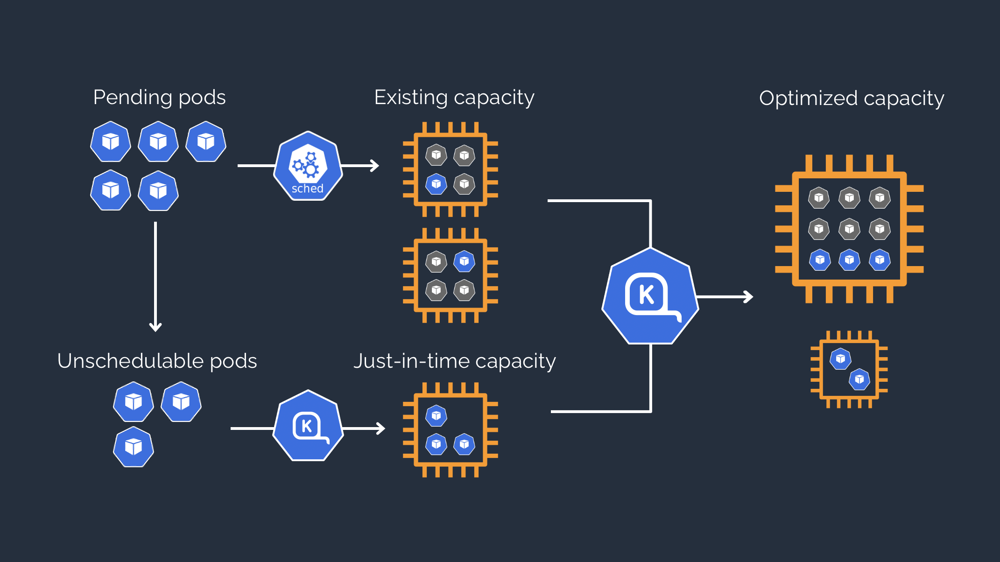

# Karpenter

## Introduction

[Karpenter](https://karpenter.sh/) is an open-source cluster autoscaler that automatically provisions new nodes in response to unschedulable pods. Karpenter evaluates the aggregate resource requirements of the pending pods and chooses the optimal instance type to run them. It will automatically scale-in or terminate instances that don’t have any non-daemonset pods to reduce waste. It also supports a consolidation feature which will actively move pods around and either delete or replace nodes with cheaper versions to reduce cluster cost.

Without Karpenter, Kubernetes users relied primarily on Amazon EC2 Auto Scaling groups and the Kubernetes Cluster Autoscaler (CAS) to dynamically adjust the compute capacity of their clusters. The downside here is that for each node group you are stuck with the same instance type across all nodes. This has as effect that not all nodes are optimally used based on the pods that are running on these nodes.

With Karpenter, depending on the cluster needs it will determine (within the constraints that were put up) what instance is best suited to accomodate the needs of the pods and will launch that node.

## Pros and cons

### Pros

1. Efficiency: Karpenter is designed to efficiently pack pods onto nodes to minimize costs. It does this by considering the actual resource requirements of the pods, rather than just the requests.

2. Scalability: Karpenter can rapidly scale up and down in response to workload changes. This makes it suitable for environments with highly variable workloads.

3. Simplicity: Karpenter aims to be simpler to set up and manage than some other Kubernetes autoscalers. It integrates directly with Kubernetes Scheduling and doesn't require a separate cluster autoscaler.

### Cons

1. Maturity: As of now, Karpenter is a relatively new project and may not have the same level of maturity or feature completeness as some other autoscalers.

2. Potential for Overspending: While Karpenter can help reduce costs by packing pods efficiently, it can also lead to overspending if not configured correctly. For example, if it scales up too aggressively or if the pod resource requirements are set too high.

**Remember to evaluate Karpenter in the context of your specific needs and environment before deciding to use it.**

## How it works



Karpenter observes the aggregate resource requests of unscheduled pods and makes decisions to launch and terminate nodes to minimize scheduling latencies and infrastructure cost.

## Infrastructure

[It is not recommended to run Karpenter on a node that is managed by Karpenter](https://aws.github.io/aws-eks-best-practices/karpenter/#run-the-karpenter-controller-on-eks-fargate-or-on-a-worker-node-that-belongs-to-a-node-group). Therefore we opted to deploy Karpenter on Fargate nodes.

Karpenter launches EC2 instances directly from the AWS API, therefore you won't be seeing an autoscaling group in AWS anymore for the [NodePool](https://karpenter.sh/docs/concepts/nodepools/) that is provisioned for your instances. If you want to have a visual representation of the nodes and their usage we recommend using the [eks-node-viewer](https://github.com/awslabs/eks-node-viewer) command from AWS.

## Pre-requisites

Due to the nature of Karpenter it can be quite agressive in killing pods to reach its desired cluster state. Therefore we need to make sure we set some safeguards to make sure the workloads running on the cluster are not affected in a negative way.

We recommend to follow [these best practices](https://aws.github.io/aws-eks-best-practices/karpenter/#scheduling-pods). This is a general recommendation, but especially important when using Karpenter.

- Use [topologySpreadConstraints](https://karpenter.sh/docs/concepts/scheduling/#topology-spread) in your deployments
- Use [PodDisruptionBudget](https://karpenter.sh/docs/troubleshooting/#disruption-budgets) in your deployments
- Have [nodeAffinity](https://kubernetes.io/docs/concepts/scheduling-eviction/assign-pod-node/#node-affinity) rules set on PVs
- Have [do-not-evict annotations](https://aws.github.io/aws-eks-best-practices/karpenter/#use-the-do-not-evict-annotation-to-prevent-karpenter-from-deprovisioning-a-node) set on pods that may not be evicted
- Have [requests=limits](https://aws.github.io/aws-eks-best-practices/karpenter/#configure-requestslimits-for-all-non-cpu-resources-when-using-consolidation) on Memory resources configured

## Usage

### Concepts

- [NodePools](https://karpenter.sh/docs/concepts/nodepools/)
- [NodeClasses](https://karpenter.sh/docs/concepts/nodeclasses/)
- [Scheduling](https://karpenter.sh/docs/concepts/scheduling/)
- [Disruption](https://karpenter.sh/docs/concepts/disruption/)

### Configuration

A Skyscrapers engineer can help you to enable Karpenter or you can update your cluster definition file, through pull request:

```yaml
  karpenter:
    node_pools:
      default:
        node_class:
          extra_securitygroup_ids: []
          gpu_enabled: false
          public: false
          tags:
            team: myteam
          volumeSize: "100Gi"
        annotations:
          role: foo
        labels:
          role: foo
        limits:
          cpu: 111
          memory: "100Gi"
        requirements:
          - key: "karpenter.k8s.aws/instance-category"
            operator: In
            values: ["c", "m", "r"]
          - key: karpenter.k8s.aws/instance-generation
            operator: In
            values: ["5", "6"]
          - key: "karpenter.sh/capacity-type"
            operator: In
            values: ["spot", "on-demand"]
        taints:
          - effect: NoSchedule
            key: role
            value: foo
```

`node_pools` is a dictionary that defines the configuration for different pools of nodes. In this case, there is one node pool named `default`.

Under `default`, there are several properties that define the configuration of the nodes in this pool:

- `node_class` (optional): defines the properties of the nodes, such as whether they have a GPU (`gpu_enabled`), whether they are public (`public`), their volume size (`volumeSize`), etc.

- `annotations` (optional): are key-value pairs that can be used to attach arbitrary non-identifying metadata to nodes.

- `labels` (required): are key-value pairs that can be used to select nodes for scheduling pods.

- `limits` (required): define the maximum amount of CPU and memory that can be used by the nodes. **This is important to set to not cause unexpected costs!**

- `requirements` (required):  define the conditions that must be met for a node to be included in the node pool. See also the requirements section below.

- `taints` (optional): are used to repel pods from being scheduled on the nodes. In this case, pods that do not tolerate the taint `role: foo` will not be scheduled on the nodes.

### Defining requirements

```yaml
        requirements:
          - key: "karpenter.k8s.aws/instance-category"
            operator: In
            values: ["c", "m", "r"]
          - key: karpenter.k8s.aws/instance-generation
            operator: Gt
            values: ["4"]
          - key: "topology.kubernetes.io/zone"
            operator: In
            values: ["eu-west-1a", "eu-west-1b", "eu-west-1c"]
          - key: "kubernetes.io/arch"
            operator: In
            values: ["amd64"]
          - key: "karpenter.sh/capacity-type"
            operator: In
            values: ["on-demand"]
          - key: node.kubernetes.io/instance-type
            operator: NotIn
            values: ["m5a.16xlarge", "m5a.24xlarge"]
```

This YAML snippet is a part of a Karpenter configuration file. It defines a list of `requirements` that nodes must meet to be included in a specific node pool. Each requirement is defined by a `key`, an `operator`, and a list of `values`. All requirements in this list are optional and should be set to limit the options of Karpenter.

The above example explained:

1. specifies the [`instance-category`](https://karpenter.sh/docs/reference/instance-types/) of the node, as defined by the key `karpenter.k8s.aws/instance-category`, must be either "c", "m", or "r". The `In` operator means the actual value must be in the provided list.

2. specifies the `instance-generation` of the node, as defined by the key `karpenter.k8s.aws/instance-generation`, must be greater than "4". The `Gt` operator stands for "greater than".

3. specifies the `zone` of the node, as defined by the key `topology.kubernetes.io/zone`, must be either "eu-west-1a", "eu-west-1b", or "eu-west-1c".

4. specifies the architecture of the node, as defined by the key `kubernetes.io/arch`, must be "amd64".

5. specifies the `capacity-type` of the node, as defined by the key `karpenter.sh/capacity-type`, must be "on-demand".

6. specifies the `instance-type` of the node, as defined by the key `node.kubernetes.io/instance-type`, must not be "m5a.16xlarge" or "m5a.24xlarge". The `NotIn` operator means the actual value must not be in the provided list.

In summary, these requirements define the characteristics that nodes must have or not have to be included in the node pool.

**Important: at this moment we recommend to excluding the 7th generation of instances by default as that generation has an increased price over the other generations!**

### How to deal with node management

Once Karpenter detects a change in its NodePool(s) it will automatically take action to reach that desired state. Some examples:

- A new AMI is published: Karpenter will take action and rotate all nodes to the new AMI version.
- A change in the requirements is published: Karpenter will take action so all nodes match with the requirements.

## Debugging

Karpenter itself can be debugged by looking at the logs of the containers. This can either be done in CloudWatch logs or through the CLI with`kubectl -n kube-system logs -f deployment/karpenter`.

When nodes act up node debugging can be done with SSM. Nodes can be removed by running `kubectl delete node ip-x-x-x-x.eu-west-1.compute.internal`

More in depth documentation on how to troubleshoot karpenter can be found [here](https://karpenter.sh/docs/troubleshooting/).

### FailedScheduling pods with PV claim

On some old PVs it can be that there are no nodeAffinity rules set. Karpenter therefore doesn't know to what zone it needs to map that volume to schedule that pod.
In order to fix this add the following to your PV:

```yaml
  nodeAffinity:
    required:
      nodeSelectorTerms:
      - matchExpressions:
        - key: topology.kubernetes.io/region
          operator: In
          values:
          - <your-region>
        - key: topology.kubernetes.io/zone
          operator: In
          values:
          - <your-region><your-pv-zone-id>
```

Using the proper topology contraints are very important but more so with karpenter. Our CSI driver should do this automatically for new volumes, but older ones might not have it.
