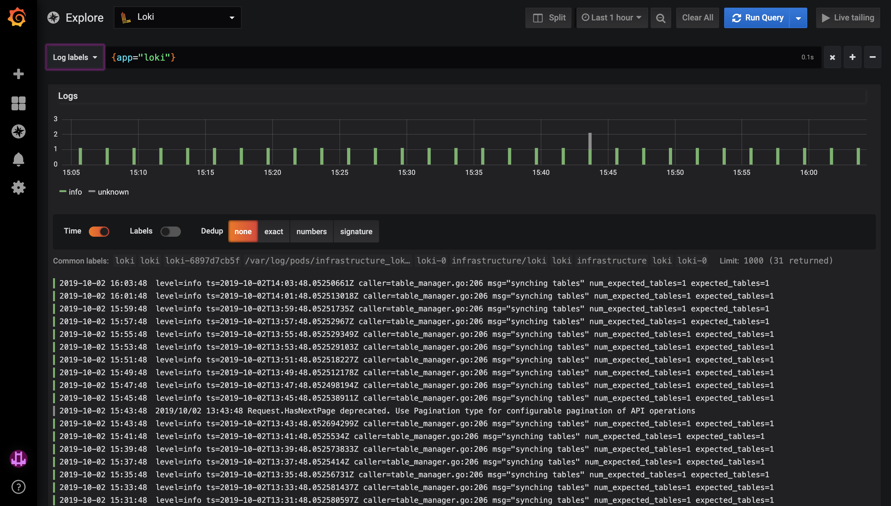

# Kubernetes logging

## Grafana Loki

By default we provide [Grafana Loki](https://grafana.com/oss/loki) as a solution for centralized access to your logs.

> Unlike other logging systems, Loki is built around the idea of only indexing metadata about your logs: labels (just like Prometheus labels). Log data itself is then compressed and stored in chunks in object stores such as S3 or GCS, or even locally on the filesystem. A small index and highly compressed chunks simplifies the operation and significantly lowers the cost of Loki.

You can access this through your Grafana dashboard by clicking `Explore` in the sidebar and selecting `Loki` as datasource.

Loki comes with it's own query language, LogQL, for which you can find the documentation here: <https://github.com/grafana/loki/blob/master/docs/logql.md>.

**Note:** the default limit of log lines in Grafana is 1000. This is the default limit and is in place to keep the Grafana resource footprint low. This is however a parameter and can be adjusted on a per-customer basis case.

Because Loki is integrated into Grafana, you can also add log panels to your application-specific dashboards in Grafana.

### Log sources

As of now, the logs that are picked up by Promtail are the same that are available through `kubectl logs`, which are the `stdout` and `stderr` streams of all containers running in a Pod. In other words, everything that's dumped in `stdout` and `stderr` of every container will be available in Loki.

### Architecture

Our Loki stack uses the following components:

- [Grafana Loki](https://github.com/grafana/loki/blob/master/docs/overview/README.md)
- [Promtail](https://github.com/grafana/loki/blob/master/docs/clients/promtail/README.md) which ships the container logs to Loki. Promtail is deployed as K8s Daemonset.
- [AWS S3](https://aws.amazon.com/s3/) used for storing log chunk data
- [AWS DynamoDB](https://aws.amazon.com/dynamodb/) used for indexing the log chunks
  - Tables are automatically rotated
