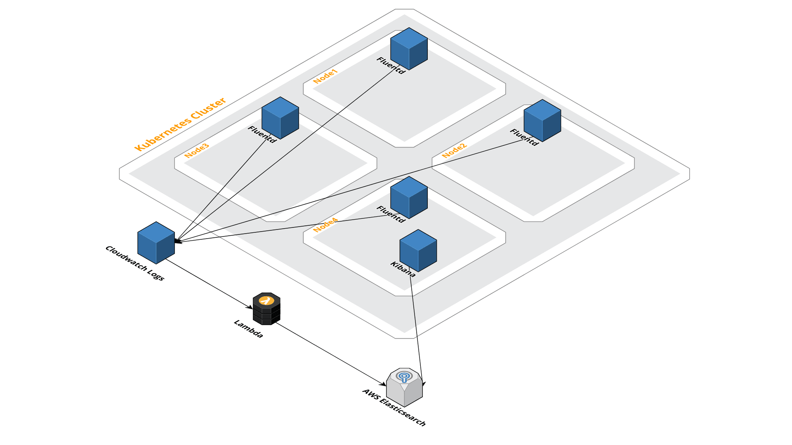

# Kubernetes logging

## Grafana Loki

By default we provide [Grafana Loki]() as a solution for centralized access to your logs.

> Unlike other logging systems, Loki is built around the idea of only indexing metadata about your logs: labels (just like Prometheus labels). Log data itself is then compressed and stored in chunks in object stores such as S3 or GCS, or even locally on the filesystem. A small index and highly compressed chunks simplifies the operation and significantly lowers the cost of Loki.

You can access this through your Grafana dashboard by clicking `Explore` in the sidebar and selecting `Loki` as datasource.


Loki comes with it's own query language, LogQL, for which you can find the documentation here: <https://github.com/grafana/loki/blob/master/docs/logql.md>.

Because Loki is integrated into Grafana, you can also add log panels to your application-specific dashboards in Grafana.

### Architecture

Our Loki stack uses the following components:

- [Grafana Loki](https://github.com/grafana/loki/blob/master/docs/overview/README.md)
- [Promtail](https://github.com/grafana/loki/blob/master/docs/clients/promtail/README.md) which ships the container logs to Loki. Promtail is deployed as K8s Daemonset.
- [AWS S3](https://aws.amazon.com/s3/) used for storing log chunk data
- [AWS DynamoDB](https://aws.amazon.com/dynamodb/) used for indexing the log chunks
  - Tables are automatically rotated

## Kibana / Elasticsearch (deprecated)

We use the following components for our logging stack:

- [Fluentd](https://www.fluentd.org/)
- [AWS Cloudwatch logs](https://docs.aws.amazon.com/AmazonCloudWatch/latest/logs/WhatIsCloudWatchLogs.html)
- [AWS Elasticsearch](https://aws.amazon.com/elasticsearch-service/)
- [Kibana](https://www.elastic.co/products/kibana)

### Architecture

Logs are picked up by a Fluentd `DaemonSet` that is running on every Kubernetes node. We have a default config to pick up all container logs and ship those to CloudWatch logs. We use CloudWatch logs as a buffer and archiving system. On CloudWatch logs we have a subscription stream active that streams the logs to AWS Elasticsearch with an Lambda function. Once they are in AWS Elasticsearch, we can access the logs with Kibana. You'll find your Kibana URL in the `README.md` file of your GitHub repo, it'll be something like `https://kibana.staging.yourcompanyname.com` and `https://kibana.production.yourcompanyname.com`.



### Log sources

As of now, the logs that are picked up by Fluentd are the same that are available through `kubectl logs`, which are the `stdout` and `stderr` streams of all containers running in a Pod. In other words, everything that's dumped in `stdout` and `stderr` of every container will be available in Kibana.

Under the hood, Kubernetes uses the default Docker log driver, which is the [`json-file`](https://docs.docker.com/config/containers/logging/json-file/#usage). This is the first component that your logs will go through, so you should be aware of how this driver treats and modifies your logs.

Additionally, there are some other system logs that are also picked up and available in Kibana, such as the `kubelet` and `dockerd` service logs, the startup script, etc.

### Log formatting

All log lines are turned into a JSON map with some added metadata:

- `log`: the original plain text line
- `stream`: either `stdout` or `stderr`
- `time`: the time when the log entry was ingested

**Note**: The Docker json logging driver treats each line as a separate message. When using the Docker logging driver, there is no direct support for multi-line messages.

#### Time

The time of your final log entries will be the one added by the Docker logging driver at the time of ingestion, which can suppose a small difference with the time when the log entry was generated, normally no longer than a few microseconds or a couple of milliseconds.

#### JSON log entries

If your original log entries are JSON maps, those entries are escaped and set as-is in the `log` attribute of the JSON map generated by the Docker logging driver.

In a later stage, when the logs end up in Elasticsearch, the `log` attribute that contains an escaped JSON map will be expanded and will be available as fields of the log entry. Here's an example:

The container logs the following to `stdout`:

```json
{"foo":"bar","level":"info"}
```

The Docker logging plugin will log that as:

```json
{"log":"{\"foo\":\"bar\",\"level\":\"info\"}","stream":"stdout","time":"2019-01-03T12:09:18.844939857Z"}
```

Afterwards, Fluentd adds some Kubernetes metadata and it ships it to CloudWatch logs like:

```json
{
  "log": "{\"foo\":\"bar\",\"level\":\"info\"}",
  "stream": "stdout",
  "docker": {
    "container_id": "7ff0c30169ef833873ee1c67db483f71638e55fb6e7cd3334b9ef749a11df744"
  },
  "kubernetes": {
    "container_name": "something",
    "namespace_name": "default",
    "pod_name": "something",
    "container_image": "sha256:750279afe98f6e71f4adb29b1c025a21f1428c1d25211bbcf1e30f2d81ead4d2",
    "container_image_id": "docker-pullable://quay.io/skyscrapers/something@sha256:e2fd60ff0ae4500a75b80ebaa30e0e7deba9ad107833e8ca53f0047c42c5a057",
    "pod_id": "7ff0c30169ef833873ee1c67db483f71638e55fb6e7cd3334b9ef749a11df744",
    "labels": {
      "app": "example-app",
      "component": "app",
      "release": "example-app"
    },
    "host": "ip-10-19-208-214.eu-west-1.compute.internal",
    "master_url": "https://100.64.0.1:443/api",
    "namespace_id": "bb014d55-0f66-11e9-bfbe-0a01d59392ae",
    "namespace_labels": {
      "prometheus": "true"
    }
  }
}
```

And finally, it ends up in Kibana / Elasticsearch like:

```json
{
  "_index": "cwl-2019.01.04",
  "_type": "kubernetes",
  "_id": "34490501621967913818452806894023292948478156754441666560",
  "_version": 1,
  "_score": null,
  "_source": {
    "log": "{\"foo\":\"bar\",\"level\":\"info\"}",
    "stream": "stdout",
    "docker": {
      "container_id": "7ff0c30169ef833873ee1c67db483f71638e55fb6e7cd3334b9ef749a11df744"
    },
    "kubernetes": {
      "container_name": "something",
      "namespace_name": "default",
      "pod_name": "something",
      "container_image": "sha256:750279afe98f6e71f4adb29b1c025a21f1428c1d25211bbcf1e30f2d81ead4d2",
      "container_image_id": "docker-pullable://quay.io/skyscrapers/something@sha256:e2fd60ff0ae4500a75b80ebaa30e0e7deba9ad107833e8ca53f0047c42c5a057",
      "pod_id": "7ff0c30169ef833873ee1c67db483f71638e55fb6e7cd3334b9ef749a11df744",
      "labels": {
        "app": "example-app",
        "component": "app",
        "release": "example-app"
      },
      "host": "ip-10-19-208-214.eu-west-1.compute.internal",
      "master_url": "https://100.64.0.1:443/api",
      "namespace_id": "bb014d55-0f66-11e9-bfbe-0a01d59392ae",
      "namespace_labels": {
        "prometheus": "true"
      }
    },
    "log_json": {
      "foo": "bar",
      "level": "info"
    },
    "@id": "34490501621967913818452806894023292948478156754441666560",
    "@timestamp": "2019-01-03T12:09:18.844Z",
    "@message": "{\"log\":\"{\\\"foo\\\":\\\"bar\\\",\\\"level\\\":\\\"info\\\"}\",\"stream\":\"stdout\",\"docker\":{\"container_id\":\"7ff0c30169ef833873ee1c67db483f71638e55fb6e7cd3334b9ef749a11df744\"},\"kubernetes\":{\"container_name\":\"something\",\"namespace_name\":\"default\",\"pod_name\":\"something\",\"container_image\":\"sha256:750279afe98f6e71f4adb29b1c025a21f1428c1d25211bbcf1e30f2d81ead4d2\",\"container_image_id\":\"docker-pullable://quay.io/skyscrapers/something@sha256:e2fd60ff0ae4500a75b80ebaa30e0e7deba9ad107833e8ca53f0047c42c5a057\",\"pod_id\":\"7ff0c30169ef833873ee1c67db483f71638e55fb6e7cd3334b9ef749a11df744\",\"labels\":{\"app\":\"example-app\",\"component\":\"app\",\"release\":\"example-app\"},\"host\":\"ip-10-19-208-214.eu-west-1.compute.internal\",\"master_url\":\"https://100.64.0.1:443/api\",\"namespace_id\":\"bb014d55-0f66-11e9-bfbe-0a01d59392ae\",\"namespace_labels\":{\"prometheus\":\"true\"}}}",
    "@owner": "12345678901",
    "@log_group": "kubernetes",
    "@log_stream": "kubernetes.var.log.containers.something-848c6dfb58-t2cbg_default_something-1b0f48647e291a554f1fac594be8e07acbe817464a3d4b35b390d3b9766fd146.log"
  },
  "fields": {
    "@timestamp": [
      "2019-01-03T12:09:18.844Z"
    ]
  },
  "sort": [
    1546607582613
  ]
}
```

As you can see, the original JSON map is in the `_source.log_json` attribute of the final Kibana entry.

### Log browsing and filtering

To learn how to use Kibana and all its features, the best place to start is the official [Kibana user guide](https://www.elastic.co/guide/en/kibana/6.5/discover.html). In there you'll find the basics on how to browse and filter your logs, different ways to visualize them and how to create useful dashboards.

#### Indexes

All logs from the cluster are sent to ElasticSearch indexes that are available to be queried in Kibana. There's an index for each day of data, for example:

- `cwl-2019.03.22` has all log entries for the 22nd of March 2019

The default index pattern in Kibana is `cwl-*`, which combines the data for all the daily indexes.

#### Querying data

Once you are familiar with the basics, you'll be able to use all the added Kubernetes metadata to get the most out of Kibana. You can filter by all the fields that are indexed. Here are some examples:

You can add a filter to show only the logs of a given pod:

```yaml
kubernetes.pod_name: "your-pod-name"
```

Or by namespace:

```yaml
kubernetes.namespace: "your-application"
```

By a Helm release:

```yaml
kubernetes.labels.release: "example-app"
```

You can even add filters on attributes from your JSON logs, if those attributes are indexed:

```yaml
log_json.statusCode: 200
```

#### Building visualizations

If you want to create a single graph on some data metrics a visualization is what you need. How you can set this up can be found [here](https://www.elastic.co/guide/en/kibana/current/tutorial-visualizing.html). If you want to create multiple graphs on the same window you need to create a dashboard.

#### Building dashboards

For this we suggest using [the elastic documentation](https://www.elastic.co/guide/en/kibana/current/tutorial-build-dashboard.html).

### Caveats

There are some caveats related to the ElasticSearch indexes used in this setup.

#### Index field mismatch

ElasticSearch has dynamic field mapping enabled by default.

> By default, when a previously unseen field is found in a document, Elasticsearch will add the new field to the type mapping.

*Note that in our setup, a "document" is a log entry.*

This, combined with the expansion of JSON log entries, is really useful to be able to filter and query your logs by arbitrary fields that are particular to your log data. For example `log_json.request.headers.x-example-somthing: foo`. As ElasticSearch indexes all those fields automatically when it first encounters them in a log entry.

The problem with this is that when a field is mapped in an index, ElasticSearch will reject any log entries that have that field set with a different type.

For example, let's assume this log entry is sent to ES today:

```json
{
  "params": "foo"
}
```

ES will create a field named `params` of type string in index `cwl-2019.03.21`.

Subsequent log entries that come into ES today that have the `params` field with a different type will be rejected. For example:

```json
{
  "params":{
    "foo": ["bar"]
  }
}
```

If the reverse happens and the first log entry of the day has `{"params":{"foo":["bar"]}}`, all subsequent log entries containing `"params":"foo"` will be rejected.

It is possible to have entries with different field types in different days, as they are stored in different indexes. Although in this case, Kibana will display a warning message on such fields informing about the mismatch. Example:


#### Index field limit

As mentioned previously, all fields in your log data are mapped into the ElasticSearch indexes, so you can easily create filters and queries. Those fields include all attributes in your JSON logs, for example consider this log entry:

```json
{
  "@timestamp": "2019-03-20T22:34:07.058494+00:00",
  "@version": 1,
  "host": "example",
  "message": "Transaction",
  "level": "INFO",
  "request": {
    "method": "POST",
    "uri": "https://example.com/api.list",
    "path": "/api.list",
    "headers": {
      "user-agent": [
        "Mozilla/5.0 (X11; Linux mabl) AppleWebKit/537.36 (KHTML, like Gecko) Chrome/72.0.3626.121 Safari/537.36"
      ],
      "accept-language": [
        "en-US,en;q=0.9"
      ],
      "content-type": [
        "application/json"
      ],
      "authorization": "REDACTED",
      "content-length": [
        "2"
      ],
    },
    "body": "{}"
  },
  "response": {
    "status": 200,
    "headers": {
      "Date": [
        "Wed, 20 Mar 2019 22:34:07 GMT"
      ],
      "Content-Type": [
        "application/json;charset=utf-8"
      ],
      "Connection": [
        "keep-alive"
      ],
    }
  },
  "took": 0.10072088241577148,
}
```

With the above log entry, ElasticSearch would map the following fields in the index:

- `@timestamp`
- `@version`
- `host`
- `message`
- `level`
- `request.method`
- `request.uri`
- `request.path`
- `request.headers.user-agent`
- `request.headers.accept-language`
- `request.headers.content-type`
- `request.headers.authorization`
- `request.headers.content-length`
- `request.body`
- `response.status`
- `response.headers.Date`
- `response.headers.Content-Type`
- `response.headers.Connection`
- `took`

As you can see the number of fields in the ElasticSearch indexes can grow very quickly depending on the data you're logging. [From the official ElasticSearch documentation](https://www.elastic.co/guide/en/elasticsearch/reference/current/mapping.html#mapping-limit-settings):

> Defining too many fields in an index is a condition that can lead to a mapping explosion, which can cause out of memory errors and difficult situations to recover from.

That's why we keep the default limit of 1000 for the amount of fields in an index, which should be more than enough for most use-cases. When this limit is reached, any new log entries that would introduce new fields in the index will be rejected.
