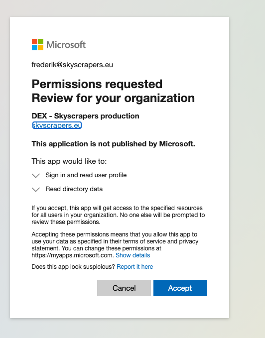
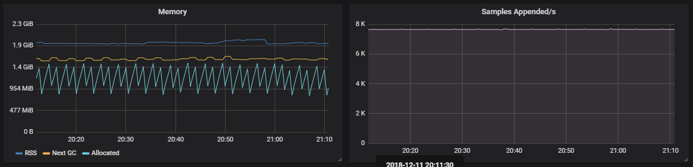
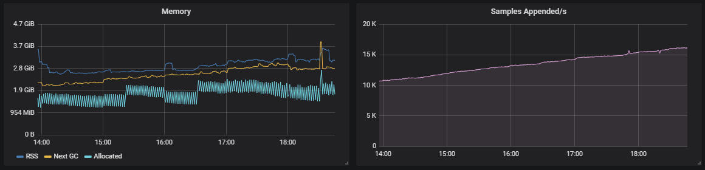

# Monitoring

We use a [Prometheus](https://prometheus.io/), [Alertmanager](https://prometheus.io/docs/alerting/alertmanager/) and [Grafana](https://grafana.com/) stack for a complete monitoring setup of both our clusters and applications running on them.

We make use of the CoreOS _operator_ principle: by deploying [prometheus-operator](https://github.com/coreos/prometheus-operator) we define new Kubernetes Custom Resource Definitions (CRD) for `Prometheus`, `Alertmanager`, `ServiceMonitor` and `PrometheusRule` which are responsible for deploying Prometheus and Alertmanager setups, Prometheus scrape targets and alerting rules, respectively.

As of this writing there isn't an operator setup yet for Grafana, but you can add custom dashboards dynamically via `ConfigMaps`.

- Prometheus does the _service monitoring_ and keeps time-series data.
- Alertmanager is responsible for handling alerts, based on _rules_ from Prometheus. In our case Alertmanager is responsible for making sure alerts end up in [Opsgenie](https://www.opsgenie.com/) and Slack.
- Grafana provides nice charts and dashboards of the Prometheus time-series data.

- [Monitoring](#monitoring)
  - [Accessing the monitoring dashboards](#accessing-the-monitoring-dashboards)
    - [Github](#github)
    - [Microsoft Azure](#microsoft-azure)
  - [Kubernetes application monitoring](#kubernetes-application-monitoring)
    - [Example ServiceMonitor](#example-servicemonitor)
    - [Example PrometheusRule](#example-prometheusrule)
    - [Example Grafana Dashboard](#example-grafana-dashboard)
  - [AWS services monitoring](#aws-services-monitoring)
  - [Recommendations and best practices](#recommendations-and-best-practices)
    - [Prometheus labels](#prometheus-labels)
  - [Prometheus scrapers for common technologies](#prometheus-scrapers-for-common-technologies)
    - [PHP](#php)
      - [Native](#native)
      - [PHP-FPM](#php-fpm)
    - [Ruby](#ruby)
      - [Native](#native-1)
      - [Workers](#workers)
    - [Nginx](#nginx)
      - [Setup](#setup)
    - [RabbitMQ](#rabbitmq)

## Accessing the monitoring dashboards

Prometheus, Alertmanager and Grafana are accessible via their respective dashboards. These dashboards are exposed via Ingresses, either private or public, depending on your cluster's configuration. If the dashboards are set to be private, you'll need to be connected to the cluster's VPN in order to access them.

These monitoring dashboards are secured via [Dex](https://dexidp.io/), which adds an authentication layer. Dex can be configured with multiple identity providers to provide a seamless authentication experience. The most typical providers that we use are GitHub and Azure, which are explained in more detail below. Dex configuration is specific to each cluster, and is currently managed by Skyscrapers, although some integration details might need to be provided by you (the customer).

### Github

The GitHub integration uses the GitHub OAuth2 flow, and it's pretty straight-forward to configure. In most cases, we will set up this integration for you, creating the OAuth application in our GitHub organization. For reference, this is the official [Dex documentation](https://dexidp.io/docs/connectors/github/) to configure this integration.

### Microsoft Azure

[Dex Microsoft connector](https://dexidp.io/docs/connectors/microsoft/) also works with Azure accounts and tenants. You'll need to register a new application in your Azure tenant. To do so, go to the Azure Active Directory portal for the correct tenant, go to `App Registrations` in the side bar and click `New registration`. You can give it the name you want, something significant like `DEX - <cluster name>`. Once the application is created, you'll need to create a client secret by going to `Certificates & secrets` in the side bar and clicking the `New client secret` button.

Once the application is registered and configured, you'll have to provide us with the following information:

- application client id
- application secret value
- tenant id
- the list of groups to authorize in Dex. Users belonging to these groups will be granted access.

In some cases, you might need to give the application special admin consent so Dex is able to list groups on behalf of logged in user. If that is the case, you'll need to add an explicit `Directory.Read.All` permission to the list of `Delegated Permissions` and then open the following link in your browser and log in under organization administrator account: `https://login.microsoftonline.com/<tenant>/adminconsent?client_id=<dex client id>`. You'll get a page similar to this one:



*Note that after you click `Accept` and grant the necessary permissions, you might get an error page from Dex. That's ok and you can ignore it and close it.*

## Kubernetes application monitoring

You can also use Prometheus to monitor your application workloads and get alerts when something goes wrong. In order to do that you'll need to define your own `ServiceMonitors` and `PrometheusRules`. There are two requirementes though:

- All `ServiceMonitors` and `PrometheusRules` you define need to **have the `prometheus` label (any value will do)**.
- The **namespace** where you create your `ServiceMonitors` and `PrometheusRules` need to **have the `prometheus` label too (any value will do)**.

   ```bash
   kubectl label namespace yournamespace prometheus=true
   ```

Custom Grafana Dashboards can also be added to this same namespace by creting a `ConfigMap` with **a `grafana_dashboard` label (any value will do)**, containing the dashboard's json data. Please make sure that `"datasources"` are set to `"Prometheus"` in your dashboards!

*Note: even if these objects are created in a specific namespace, Prometheus can scrape metric targets in all namespaces.*

It is possible to configure alternative routes and receivers for Alertmanager. This is done in your cluster definition file under the addons section. Example:

   ```yaml
   spec:
    cluster_monitoring:
      alertmanager:
        custom_routes: |
          - match:
              namespace: my-namespace
            receiver: custom-receiver
   ```

- [Upstream documentation](https://prometheus.io/docs/alerting/configuration/#route)

   ```yaml
   spec:
    cluster_monitoring:
      alertmanager:
        custom_receivers_payload:
          | # (The whole yaml block should be encrypted via KMS with the context 'k8s_stack=secrets')
          - name: custom-receiver
            webhook_configs:
              - send_resolved: true
                url: <opsgenie_api_url>
   ```

- [Upstream documentation](https://prometheus.io/docs/alerting/configuration/#receiver)

*Note: This configuration can be made by creating a PR to your repo (optional), and/or communicated to your Customer Lead because this needs to be rolled out to the cluster.*

### Example ServiceMonitor

```yaml
apiVersion: monitoring.coreos.com/v1
kind: ServiceMonitor
metadata:
  labels:
    prometheus: application
  name: myapplication-php-fpm-exporter
  namespace: mynamespace
spec:
  endpoints:
    - targetPort: 8080
      interval: 30s
  namespaceSelector:
    matchNames:
      - production
  selector:
    matchLabels:
      app: application
      component: php
```

You can find more examples in the official [Prometheus Operator documentation](https://github.com/coreos/prometheus-operator/tree/master/Documentation/user-guides) or get inspired by the ones already deployed in the cluster:

```bash
kubectl get servicemonitors --all-namespaces
```

### Example PrometheusRule

```yaml
apiVersion: monitoring.coreos.com/v1
kind: PrometheusRule
metadata:
  labels:
    prometheus: application
  name: myapplication-alert-rules
  namespace: mynamespace
spec:
  groups:
  - name: myapplication.rules
    rules:
    - alert: MyApplicationPhpFpmDown
      expr: phpfpm_up{job="application"} == 0
      for: 10m
      labels:
        severity: critical
        client: MyCompanyName
      annotations:
        description: '{{`{{ $value }}`}}% of {{`{{ $labels.job }}`}} PHP-FPM are down!'
        summary: PHP-FPM down
        runbook_url: 'https://github.com/myorg/myapplication/tree/master/runbook.md#alert-name-myapplicationphpfpmdown'
```

You can find more examples in the official [Prometheus Operator documentation](https://github.com/coreos/prometheus-operator/tree/master/Documentation/user-guides) or get inspired by the ones already deployed in the cluster:

```bash
kubectl get prometheusrules --all-namespaces
```

**Note:** we highly recommend including a `runbook_url` annotation to all alerts so the engineer that handles those alerts has all the needed information and can troubleshoot issues faster.

### Example Grafana Dashboard

```yaml
apiVersion: v1
kind: ConfigMap
metadata:
  labels:
    grafana_dashboard: application
  name: grafana-dashboard-myapplication
  namespace: mynamespace
data:
  grafana-dashboard-myapplication.json: |
{ <Grafana dashboard json> }
```

You can get inspired by some of the dashboards already deployed in the cluster:

```bash
kubectl get configmaps -l grafana_dashboard --all-namespaces
```

## AWS services monitoring

AWS services can also be monitored via Prometheus and Alertmanager, like the rest of the cluster. To do so we use the [Prometheus cloudwatch-exporter](https://github.com/prometheus/cloudwatch_exporter), which imports CloudWatch metrics into Prometheus. From there we can build alerts that trigger when some conditions happen.

The cloudwatch-exporter is not deployed by default as a base component of the reference solution, as it's highly dependent on the customer needs.

We provide pre-made Helm charts for some AWS resources, like [RDS](https://github.com/skyscrapers/charts/tree/master/rds-monitoring), [Redshift](https://github.com/skyscrapers/charts/tree/master/redshift-monitoring) and [Elasticsearch](https://github.com/skyscrapers/charts/tree/master/elasticsearch-monitoring), which deploy the cloudwatch-exporter and some predefined alerts, but additional cloudwatch-exporters can be deployed to import any other metrics needed. Be aware that exporting data from Cloudwatch is quite costly, and every additional exported metric requires additional API calls, so make sure you only export the metrics you'll use.

Normally, you'll deploy a different cloudwatch-exporter for each AWS service that you want to monitor, as each of them will probably require different period configurations.

You'll also need an IAM role for the cloudwatch-exporter with the following policy:

```json
{
  "Version": "2012-10-17",
  "Statement": [
    {
      "Effect": "Allow",
      "Action": [
        "cloudwatch:ListMetrics",
        "cloudwatch:GetMetricStatistics",
        "tag:GetResources"
      ],
      "Resource": "*"
    }
  ]
}
```

*Note that a single role can be used for all cloudwatch exporters deployed on the same cluster.*

## Recommendations and best practices

### Prometheus labels

As the [Prometheus documentation](https://prometheus.io/docs/practices/naming/#labels) states:

> Use labels to differentiate the characteristics of the thing that is being measured:
>
> - api_http_requests_total - differentiate request types: type="create|update|delete"
> - api_request_duration_seconds - differentiate request stages: stage="extract|transform|load"

It's **important** to note the CAUTION box in the documentation, that states:

> CAUTION: Remember that every unique combination of key-value label pairs represents a new time series, which can dramatically increase the amount of data stored. Do not use labels to store dimensions with high cardinality (many different label values), such as user IDs, email addresses, or other unbounded sets of values.

Not following that advise can cause the whole Prometheus setup to become unstable, go out of memory and eventually cause collateral damage on the node that's running on. A good example can be found in [this Github issue](https://github.com/prometheus/client_golang/issues/491).

This is how Prometheus would perform with "controlled" metric labels:



Vs. a Prometheus with "uncontrolled" metric labels:



## Prometheus scrapers for common technologies

Here's a list of Prometheus scrapers already available for common frameworks.

### PHP

#### Native

Prometheus has a [native client library](https://github.com/Jimdo/prometheus_client_php) for PHP. This is easy to implement inside your application, but by default doesn't expose standard metrics. This is ideal if you want to expose your own metrics (can also be business metrics).

#### PHP-FPM

If you want to get PHP-FPM metrics, we recommend using [this exporter](https://github.com/hipages/php-fpm_exporter). It's being actively maintained and the documentation is reasonably good. You have to setup the exporter as a sidecar container in your pods/task-definition, then it'll access the PHP-FPM socket to read statistics and expose them as Prometheus metrics.

You first need to expose the metrics in PHP-FPM. You can do this by adding the following config to your PHP-FPM image.

```ini
pm.status_path = /status
```

Then you'll need to add the `php-fpm-exporter` as a sidecar container to your pod/task-definition.

Here is an example for **k8s**:

```yaml
- name: {{ template "app.fullname" . }}-fpm-exporter
  image: "hipages/php-fpm_exporter:0.5.2"
  command: ["--phpfpm.scrape-uri", "tcp://127.0.0.1:{{ .Values.app.port }}/status"]
  ports:
    - name: prom
      containerPort: 9253
      protocol: TCP
  livenessProbe:
    tcpSocket:
      port: prom
    initialDelaySeconds: 10
    periodSeconds: 5
  readinessProbe:
    tcpSocket:
      port: prom
    initialDelaySeconds: 10
    timeoutSeconds: 5
```

*Note that you'll need to adjust `{{ template "app.fullname" . }}` and `{{ .Values.app.port }}` to the correct helm variables. The first one represents the app name we want to monitor. The second is the php-fpm port of the application.*

### Ruby

#### Native

Prometheus has a [native client library](https://github.com/prometheus/client_ruby) for Ruby. This is a really good library when you run your ruby application as single process. Unfortunately a lot of applications use Unicorn or another multi-process integration. When using a multi-process Ruby you can best use the [fork](https://gitlab.com/gitlab-org/prometheus-client-mmap) of GitLab.

You have to integrate this library in your application and expose it as an endpoint. Once that is done, you can add a `ServiceMonitor` to scrape it.

#### Workers

Workers by default don't expose a webserver to scrape from. This will have to change and every worker will need to expose a simple webserver so that Prometheus can scrape its metrics.

It is really discouraged to use Pushgateway for this. For more info why this is discouraged, see the [Pushgateway documentation](https://prometheus.io/docs/practices/pushing/#should-i-be-using-the-pushgateway).

### Nginx

Nginx has an exporter through the [Nginx VTS module](https://github.com/vozlt/nginx-module-vts). We [forked](https://github.com/skyscrapers/docker-images/tree/master/nginx) the official Docker Nginx image and added the VTS module to nginx. We had to fork it because the VTS module needs to be compiled with Nginx.

#### Setup

1. Use our [Nginx](https://hub.docker.com/r/skyscrapers/nginx/) Docker image instead of the upstream Nginx.
2. Add the [exporter](https://github.com/hnlq715/nginx-vts-exporter) as sidecar to the pod/task-definition.

Example for **k8s**:

```yaml
- name: {{ template "app.fullname" . }}-exporter
  image: "sophos/nginx-vts-exporter:v0.10.0"
  env:
    - name: NGINX_STATUS
      value: http://localhost:9999/status/format/json
  ports:
    - name: prom
      containerPort: 9913
```

*Note that you will need to adjust `{{ template "app.fullname" . }}` to the correct helm variables. It represents the app name you want to monitor.*

### RabbitMQ

Starting from version 3.8.0, RabbitMQ ships with built-in Prometheus & Grafana support. The Prometheus metric collector needs to be enabled via the `rabbitmq_prometheus` plugin. Head to the [official documentation](https://www.rabbitmq.com/prometheus.html#overview-prometheus) to know more on how to enable and use it.

Once the `rabbitmq_prometheus` plugin is enabled, the metrics port needs to be exposed in the RabbitMQ Pods and Service. RabbitMQ uses TCP port `15692` by default.

Then a `ServiceMonitor` is needed to instruct Prometheus to scrape the RabbitMQ service. Follow the [instructions above](#example-servicemonitor) to set up the correct `ServiceMonitor`.

At this point the RabbitMQ metrics should already be available in Prometheus. We can also deploy a RabbitMQ overview dashboard in Grafana, which displays detailed graphs and metrics from the data collected in Prometheus. Reach out to your Customer Lead in case you'd be interested in such dashboard.
