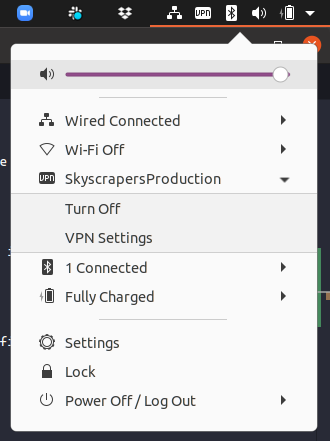

# OpenVPN

Note that all following recommendations and steps works for default configurations of the respective Operating Systems, if you are using a custom DNS configurations it might cause troubles.

## Setup OpenVPN for Windows

We recommend using the [official OpenVPN Community client](https://openvpn.net/community-downloads/). After installing it you can import the `.ovpn` file via the tray icon's context menu.

## Setup OpenVPN for macOS

We recommend using [Tunnelblick](https://tunnelblick.net/downloads.html). After installing it you can immediately import `.ovpn` file.

## Setup OpenVPN for Ubuntu

### Ubuntu 20.04 LTS with Gnome Network Manager

If you have Ubuntu Desktop 20.04 installed, everything for OpenVPN should already been installed by default. In `Settings > Network` add a new VPN connection and choose `Import from file...`. Select the `.ovpn` file we provided, give it a Name of your choice and click `Add`.

The VPN connection(s) will show up in your Notification area where you can connect with it. DNS-resolving normally also works out-of-the-box. If not, take a look at the troubleshooting instructions below.



### Others & troubleshooting DNS resolving

On older Ubuntu versions or other distro's, install the needed packages and scripts:

```bash
sudo apt-get install -y openresolv openvpn-systemd-resolved
sudo mkdir -p /etc/openvpn/scripts
sudo wget https://raw.githubusercontent.com/alfredopalhares/openvpn-update-resolv-conf/master/update-resolv-conf.sh -P /etc/openvpn/scripts/
sudo chmod +x /etc/openvpn/scripts/update-resolv-conf.sh
```

Edit your `.ovpn` file by adding the following under the `client` section:

```console
script-security 2
up /etc/openvpn/scripts/update-resolv-conf.sh
down /etc/openvpn/scripts/update-resolv-conf.sh
```

Now to launch OpenVPN run:

```bash
sudo openvpn --config /path/to/ovpn/file
```

If DNS resolving for the resources behind the VPN is not working correctly, try the following steps. After each step restart the openvpn connection and test if DNS works. You might not need all or any of these steps, depending on the state of your current system configuration.

This guide is tested on Ubuntu 18.04 LTS. We will keep adding troubleshooting steps whenever we encounter them to make sure it covers more cases. Do not hesitate to let us know if it did not work for you or if you have any additions.

- Check the content of `/etc/nsswitch.conf`, make sure `dns` is not included. i.e, instead of:

  ```console
  hosts:          files mdns4_minimal [NOTFOUND=return] resolve [!UNAVAIL=return] dns myhostname
  ```

  it should be:

  ```console
  hosts:          files dns mdns4_minimal [NOTFOUND=return] resolve [!UNAVAIL=return] myhostname
  ```

- Check `/etc/systemd/resolved.conf`, if dns is enabled, make sure to comment it out and run:

  ```bash
  sudo systemctl restart systemd-resolved.service
  ```

- If `/etc/resolv.conf` is a symlink try to remove it and restart openvpn. Check with `ls -l /etc/resolv.conf` and if it turns out to be a symlink, remove it by running `sudo rm /etc/resolv.conf`
