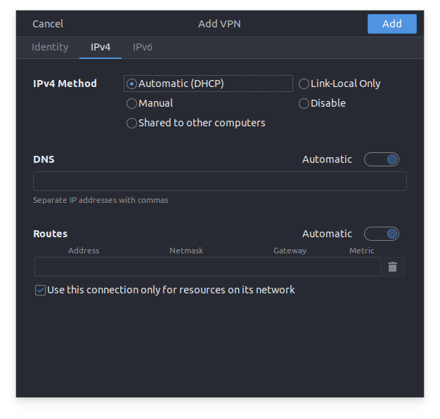

# OpenVPN

Note that all following recommendations and steps works for default configurations of the respective Operating Systems, if you are using a custom DNS configurations it might cause troubles.

## Setup OpenVPN for Windows

We recommend using the [official OpenVPN Community client](https://openvpn.net/community-downloads/). After installing it you can import the `.ovpn` file via the tray icon's context menu. Once imported, please remove the original `.ovpn` file.

## Setup OpenVPN for macOS

We recommend using [Tunnelblick](https://tunnelblick.net/downloads.html). After installing Tunnelblick, you can import the `.ovpn` file by double-clicking it. Once imported into Tunnelblick, please remove the original `.ovpn` file.

Considerations for OpenVPN on macOS:

- Make sure that **`Limit IP Address Tracking` is disabled** on your network device, otherwise you might have DNS failures and won't be able to properly resolve the private EKS cluster endpoints. You can check this in `System Preferences` -> `Network` -> `<select your Network device>` and remove the checkmark on `Limit IP Address Tracking`.
- Make sure the **`Private Relay (Beta)` feature is disabled**. You can check that in `System Preferences` -> `Apple ID` -> `iCloud` and remove the checkmark on `Private Relay (Beta)`.
- Make sure you **don't have custom DNS-servers set** on your network device. You can check that in `System Preferences` -> `Network` -> `<select your Network device>` -> `Advanced` -> `DNS`. This list should be empty. If you want to keep using your custom DNS-server when not connected to the VPN you need to check `Allow changes to manually-set network settings` on Tunnelblick's `Advanced` settings page for that VPN connection.
- (Optional) Some environments might require you to route all your traffic to go through the VPN in order to access certain endpoints. Check the option 'Route all IPv4 traffic through the VPN' to make that happen. 

## Setup OpenVPN for Linux (tested on Ubuntu 20.04 LTS)

### GUI (NetworkManager)

You can import the `.ovpn` file directly via the GUI. Open `Settings` > `Network` and click the `+` in the `VPN` section. Choose `Import from file...` and select the `.ovpn` file. Once imported, please remove the original `.ovpn` file.

Now, in the VPN connection's settings window, make sure to select the `Use this connection only for resources on its network` option in the `IPv4` (and `IPv6`) tab.



You can test if reaching internal services work via:

```bash
curl -I https://kubernetes.default.svc.cluster.local --insecure

HTTP/2 403
audit-id: 4d63cefa-cdc4-4e3c-b719-4e6fb041fa85
cache-control: no-cache, private
content-type: application/json
x-content-type-options: nosniff
content-length: 234
date: Wed, 15 Jul 2020 13:05:16 GMT
```

### CLI

Recent Ubuntu releases use `systemd-resolved` for DNS which by default [won't honor/apply DNS settings from OpenVPN](https://askubuntu.com/questions/1032476/ubuntu-18-04-no-dns-resolution-when-connected-to-openvpn).

1. First, install the requirements:

    ```bash
    sudo apt install openvpn openvpn-systemd-resolved
    ```

2. Then add the following settings to your `.ovpn` file(s):

    ```openvpn
    script-security 2
    up /etc/openvpn/update-systemd-resolved
    up-restart
    down /etc/openvpn/update-systemd-resolved
    down-pre
    ```

3. Finally start your VPN connection

    ```bash
    sudo openvpn --config <FILE.ovpn>
    ```

4. You should now be able to access resources in the VPC and the K8s cluster. Try for example:

    ```bash
    curl -I https://kubernetes.default.svc.cluster.local --insecure

    HTTP/2 403
    audit-id: 4d63cefa-cdc4-4e3c-b719-4e6fb041fa85
    cache-control: no-cache, private
    content-type: application/json
    x-content-type-options: nosniff
    content-length: 234
    date: Wed, 15 Jul 2020 13:05:16 GMT
    ```

### Older Ubuntu versions / Troubleshooting DNS resolving

If DNS resolving for the resources behind the VPN is still not working correctly, try the following steps. After each step restart the openvpn connection and test if DNS works. You might not need all or any of these steps, depending on the state of your current system configuration.

This was tested on Ubuntu 18.04 LTS. We will keep adding troubleshooting steps whenever we encounter them to make sure it covers more cases. Do not hesitate to let us know if it did not work for you or if you have any additions.

- Check the content of `/etc/nsswitch.conf`, make sure `dns` is not included. i.e, instead of:

  ```console
  hosts:          files mdns4_minimal [NOTFOUND=return] resolve [!UNAVAIL=return] dns myhostname
  ```

  it should be:

  ```console
  hosts:          files dns mdns4_minimal [NOTFOUND=return] resolve [!UNAVAIL=return] myhostname
  ```

- Check `/etc/systemd/resolved.conf`, if dns is enabled, make sure to comment it out and run:

  ```bash
  sudo systemctl restart systemd-resolved.service
  ```

- If `/etc/resolv.conf` is a symlink try to remove it and restart openvpn. Check with `ls -l /etc/resolv.conf` and if it turns out to be a symlink, remove it by running `sudo rm /etc/resolv.conf`
