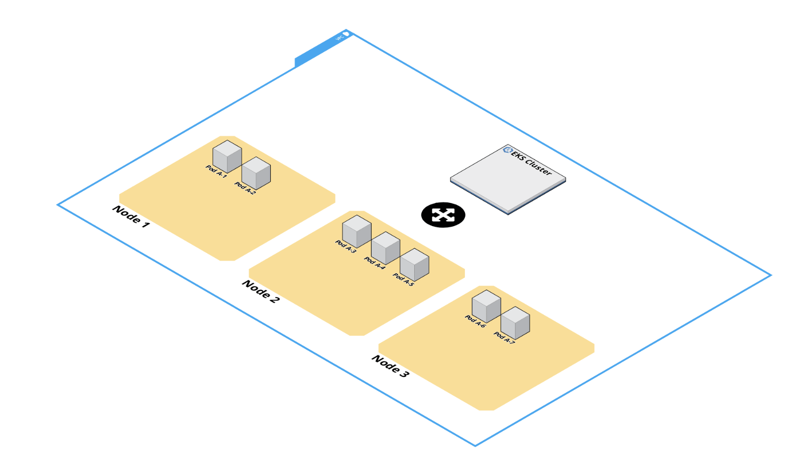

# Kubernetes 101

- [Kubernetes 101](#kubernetes-101)
  - [Intro](#intro)
  - [What the $3#! is kubernetes??](#what-the-3-is-kubernetes)
    - [Explained in a more natural language](#explained-in-a-more-natural-language)
    - [Nodes](#nodes)
    - [Pods](#pods)
      - [Anatomy of kubernetes manifests](#anatomy-of-kubernetes-manifests)
    - [Workloads](#workloads)
      - [Deployments](#deployments)
      - [StatefulSets](#statefulsets)
      - [Daemonsets](#daemonsets)
      - [Job](#job)
      - [Cronjob](#cronjob)
    - [Networking](#networking)
      - [Service](#service)
      - [Ingress](#ingress)
      - [Ingress Controller](#ingress-controller)
    - [Configuration](#configuration)
      - [Namespaces](#namespaces)
      - [Secrets](#secrets)
      - [Configmaps](#configmaps)
      - [RBAC](#rbac)
    - [A full Kubernetes cluster example](#a-full-kubernetes-cluster-example)
    - [How to interact with your platform](#how-to-interact-with-your-platform)
    - [Platform components](#platform-components)
    - [Useful documentation](#useful-documentation)

## Intro

This page is mainly created for [Skyscrapers](https://skyscrapers.eu) customers that are currently being onboarded to the platform.

It assumes no prior knowledge for Kubernetes. It should technically be a much lighter and digestible version of the kubernetes documentation, with our `Skyscrapers` flavor.

General target audience is aimed for software developers, or generally anyone that does not care to go in-depth towards infrastructure related topics.

Most of the samples are `yaml` kubernetes `manifests`. They define kubernetes objects, and they may be created via `kubectl apply -f <nameofyamlfile>.yaml`.

Bearing in mind, that some example manifests here assume some dependencies.

## What the $3#! is kubernetes??



> "Kubernetes is a portable, extensible, open-source platform for managing containerized workloads and services, that facilitates both declarative configuration and automation. It has a large, rapidly growing ecosystem. Kubernetes services, support, and tools are widely available."

### Explained in a more natural language

This is how we like to think about kubernetes.

*Imagine Kubernetes as unified software that, with a single API, allows us to orchestrate and manage containers across multiple servers seamlessly. This single API is the gateway through which developers and operations teams can deploy, scale, and monitor their applications regardless of the complexity or quantity of the services involved. It abstracts the underlying infrastructure, making it easier to manage resources, balance loads, and ensure resilience and scalability. Essentially, Kubernetes acts as a powerful, centralized control plane for containerized environments, simplifying many of the challenges associated with running applications at scale in a cloud-native ecosystem.*

For more in-depth reading, check the [official documentation for Kubernetes](https://kubernetes.io/docs/concepts/)

### Nodes

Nodes are the underlying servers that run the kubernetes software. In the case of running on AWS, they are the `EC2` instances that carry our pods.

A normal Kubernetes system is composed of one or more master nodes, and multiple worker nodes. If on AWS and using EKS, then the huge matter of scaling the master node and ensuring high availability is mitigated.

The most important things that we need to know about the nodes themselves:

- They can be either a physical or a virtual machine.
- They have the following components:
  - **Kubelet** - This agent runs on each node, ensures that containers are running in a pod.
  - **Kube-proxy** - This proxy handles networking inside and outside the cluster
  - **Container runtime** - This software is responsible for running the containers themselves, docker is an example, but of course Kubernetes supports several other runtimes.
- Just remember that the nodes inside of a kubernetes cluster can be scaled out "**virtually**" indefinitely. We usually add logical limits to our autoscale groups (In the case of using cluster autoscaler) or *Karpenter* [`nodepool`](https://karpenter.sh/docs/concepts/nodeclasses/) definitions to protect ourselves from extreme surges.

For more in-depth reading, check the [official documentation for Nodes](https://kubernetes.io/docs/concepts/architecture/nodes/)

### Pods

Just like how *mitochondria are the powerhouses of cells*, ***pods** are the powerhouses of kubernetes*

Pods are *The smallest deployable units created and managed by Kubernetes, which technically put are a group of one or more containers, with shared storage and network resources, and a specification for how to run the containers.*

Here is a YAML representation of a pod (`pod.yaml`):

```yaml
apiVersion: v1
kind: Pod
metadata:
  name: nginx
  namespace: hello-world
spec:
  containers:
  - name: nginx
    image: nginx:1.14.2
    ports:
    - containerPort: 80
    env:
    - name: HELLO
      value: "World"
```

If I run the command `kubectl apply -f pod.yaml`, I will get a `pod` that runs nginx, specifically `nginx:1.14.2`, and an env variable of `HELLO=World` inside.

As we explained earlier of course, in the pod definition, each pod is **not** limited to run a single container, but we can run multiple containers with one pod.

[More on that here](https://kubernetes.io/docs/concepts/workloads/pods/sidecar-containers/).

For more in-depth reading, check the [official documentation for Pods](https://kubernetes.io/docs/concepts/workloads/pods/)

#### [Anatomy of kubernetes manifests](https://kubernetes.io/docs/concepts/overview/working-with-objects/#required-fields)

- `apiVersion` - Which version of the Kubernetes API you're using to create this object
- `kind` - What kind of object you want to create
- `metadata` - Data that helps uniquely identify the object, including a name string, UID, and optional namespace
- `spec` - What state you desire for the object

### Workloads

#### Deployments

Alright, great, now we have our application running in a pod somewhere in the cluster, requests are coming in somehow, reaching my pod, and the pod is responding.

What happens if I will receive more traffic? we can always scale up of course, but we're always a single pod. Here comes the **Deployment** to save the day.

```yaml
apiVersion: apps/v1
kind: Deployment
metadata:
  labels:
    app: nginx
  name: nginx
spec:
  replicas: 3
  selector:
    matchLabels:
      app: nginx
  template:
    metadata:
      labels:
        app: nginx
    spec:
      containers:
      - image: nginx:1.14.2
        name: nginx
```

The Deployment is technically a Kubernetes object, that ensures we will always have the amount of pods we instruct it to. For example, if we instruct it that we want to have 3 replicas, the controller will make sure that we have 3 replicas **at all times**. For any reason if we get down to 2 replicas, *whoosh* a new replica will be created, that is the magic of the deployment.

In short the Deployment **"Manages the deployment and scaling of a set of Pods, and provides declarative updates for Pods. You describe a desired state in a Deployment, and the Deployment Controller changes the actual state to the desired state at a controlled rate."**

This is highly likely to be your choice of workload.

For more in-depth reading, check the [official documentation for deployments](https://kubernetes.io/docs/concepts/workloads/controllers/deployment/)

#### StatefulSets

Exactly like a deployment, main difference being, is that deployments generally are stateless, but if you will be running a stateful application (Which is not recommended by any means, unless if you're forced to.) then you have to choose a `StatefulSet`

In short, `StatefulSet` **Manages the deployment and scaling of a set of Pods, and provides guarantees about the ordering and uniqueness of these Pods.**

```yaml
apiVersion: apps/v1
kind: StatefulSet
metadata:
  name: web
spec:
  selector:
    matchLabels:
      app: nginx # has to match .spec.template.metadata.labels
  serviceName: "nginx"
  replicas: 3
  template:
    metadata:
      labels:
        app: nginx # has to match .spec.selector.matchLabels
    spec:
      containers:
      - name: nginx
        image: registry.k8s.io/nginx-slim:0.8
        ports:
        - containerPort: 80
          name: web
        volumeMounts:
        - name: www
          mountPath: /usr/share/nginx/html
  volumeClaimTemplates:
  - metadata:
      name: www
    spec:
      accessModes: [ "ReadWriteOnce" ]
      storageClassName: "my-storage-class"
      resources:
        requests:
          storage: 1Gi
```

For more in-depth reading, check the [official documentation for StatefulSets](https://kubernetes.io/docs/concepts/workloads/controllers/statefulset/)

#### Daemonsets

Not commonly used by end-user applications, but mostly used by us. `Daemonsets` are very similar to a deployment, but they allow us to create a pod for "each" node. Use-cases are mostly related to operations.

```yaml
apiVersion: apps/v1
kind: DaemonSet
metadata:
  name: fluentd-elasticsearch
  namespace: kube-system
  labels:
    k8s-app: fluentd-logging
spec:
  selector:
    matchLabels:
      name: fluentd-elasticsearch
  template:
    metadata:
      labels:
        name: fluentd-elasticsearch
    spec:
      containers:
      - name: fluentd-elasticsearch
        image: quay.io/fluentd_elasticsearch/fluentd:v2.5.2
        volumeMounts:
        - name: varlog
          mountPath: /var/log
      terminationGracePeriodSeconds: 30
      volumes:
      - name: varlog
        hostPath:
          path: /var/log
```

For more in-depth reading, check the [official documentation for DaemonSets](https://kubernetes.io/docs/concepts/workloads/controllers/daemonset/)

#### Job

A Job is a pod under the hood, that runs till completion and then terminates.

```yaml
apiVersion: batch/v1
kind: Job
metadata:
  name: sample
spec:
  template:
    spec:
      containers:
      - image: busybox:latest
        name: sample
        command: ["/bin/sh", "-c", "--"]
        args: ["echo Hello > hello.txt"] # Infinite loop so we keep our container running
      restartPolicy: Never
```

For more in-depth reading, check the [official documentation for Jobs](https://kubernetes.io/docs/concepts/workloads/controllers/job/)

#### Cronjob

A Cronjob is an object, that allows us to define a job that runs on a schedule.

```yaml
apiVersion: batch/v1
kind: CronJob
metadata:
  name: sample
spec:
  jobTemplate:
    metadata:
      name: sample
    spec:
      template:
        spec:
          containers:
          - image: nginx:latest
            name: sample
            command: ["/bin/sh", "-c", "--"]
            args: ["echo Hello > hello.txt"] # Just echo hello into a new file
          restartPolicy: OnFailure
  schedule: "0 4 * * *" # Typical cron syntax here
```

For more in-depth reading, check the [official documentation for CronJobs](https://kubernetes.io/docs/concepts/workloads/controllers/cron-jobs/)

### Networking

#### Service

> An abstract way to expose an application running on a set of Pods as a network service, which defines a logical selection of Pods and a policy by which to access them.

Services allow you to define how the different parts of your application communicate with each other and with the outside world.

There are several different types of services, with different purposes, let's explore them.

1. **ClusterIP**: This is the default service type. It provides a service internal to the cluster, that allows other applications in the cluster to access it. This would give the service a specific IP Address, that can be internally used, but not externally used.
2. **NodePort**: A NodePort service exposes the service on each Node's IP at a static port (the NodePort). This exposes your service to the outside world (if your nodes themselves are public) on `<NodeIP>:<NodePort>`.
3. **LoadBalancer**: This service type automatically creates an external load balancer (`elb` in our case), that forwards external traffic to the Kubernetes service.
4. **ExternalName**: This service type maps a service to a DNS name.

Simply put, most of the time you will be following this pattern.

1. Create a `Deployment`
2. Create a Service (of type `ClusterIP`) that binds to your `Deployment`
3. Create an ingress that points to your `Service` (more on this at the bottom)

For more in-depth reading, check the [official documentation for Services](https://kubernetes.io/docs/concepts/services-networking/service/)

#### Ingress

> Exposes HTTP and HTTPS routes from outside the cluster to services within the cluster. Traffic routing is controlled by logical rules.

```yaml
apiVersion: networking.k8s.io/v1
kind: Ingress
metadata:
  labels:
    app: acme
  name: acme
  namespace: acme
spec:
  ingressClassName: nginx
  rules:
  - host: mywebsite.example.com
    http:
      paths:
      - backend:
          service:
            name: acme # Needs to reference the service that points to our deployment
            port:
              number: 80
        path: /
        pathType: Prefix
```

For more in-depth reading, check the [official documentation for Ingress](https://kubernetes.io/docs/concepts/services-networking/ingress/)

#### Ingress Controller

> An application that can process and satisfy routing rules defined by Ingress objects, usually with a loadbalancer.

In our case, we use the Kubernetes nginx ingress controller. By default it creates a `Service` of type `LoadBalancer`.

We then when creating an `Ingress`, define what class of Ingress to use, we can have multiple different `Ingress` controllers. Some can be internal (using a private load balancer service) and some can be external.

For more in-depth reading, check the [official documentation for Ingress Controllers](https://kubernetes.io/docs/concepts/services-networking/ingress-controllers/)

### Configuration

#### Namespaces

> Provides a mechanism for isolating groups of resources within a single cluster

This is a logical distribution for your Kubernetes objects, while not all objects adhere to namespaces, most you will find do.

The default namespace is called `default`, whenever we run our `kubectl` commands we have to have our namespace defined with the `-n` or `--namespace` flag.

Example: `kubectl get pods -n staging` get me all pods in the staging namespace.

If I want to set a specific default namespace, instead of typing `-n staging` everytime, then I can do `kubectl config set-context --current --namespace=staging`

For more in-depth reading, check the [official documentation for Namespaces](https://kubernetes.io/docs/concepts/overview/working-with-objects/namespaces/)

#### Secrets

> Used to store confidential data in key-value pairs.

They are technically only base64 encoded, and anyone that has read access on the secrets themselves will be able to read it, but it's a smart way to inject secret data into your workloads.

You can mount them as volumes, or inject them to the environment.

For more in-depth reading, check the [official documentation for Secrets](https://kubernetes.io/docs/concepts/configuration/secret/)

#### Configmaps

> Used to store non-confidential data in key-value pairs.

Same concept of `Secrets`, only difference is they are not encoded.

Might be useful for configuration data, even simple `ini` files, or `conf` files.

For more in-depth reading, check the [official documentation for ConfigMaps](https://kubernetes.io/docs/concepts/configuration/configmap/)

#### RBAC

> Role Based Access Control

- When a user makes a request to the Kubernetes API, the Kubernetes API server determines what the user is trying to do (the verb), what resources they're trying to affect, and the namespace they're making the request in.
- The API server then checks the RoleBindings/ClusterRoleBindings to see if the user has a Role/ClusterRole that allows them to perform that action.
- If the user has the necessary permissions, the action is allowed; if not, the request is denied.

Some concepts explained in depth

1. **Roles and ClusterRoles**:
    - Role: A Role in Kubernetes is used to grant permissions within a specific namespace. It contains rules that represent a set of permissions. These permissions are purely additive (there are no "deny" rules).
    - ClusterRole: A ClusterRole is like a Role, but it is cluster-wide. It allows you to grant the same permissions across all namespaces.
2. **RoleBindings and ClusterRoleBindings**:
    - RoleBinding: A RoleBinding grants the permissions defined in a Role to a set of users. The RoleBinding can only be used in the namespace where it is created.
    - ClusterRoleBinding: A ClusterRoleBinding grants the permissions defined in a ClusterRole to a set of users across the entire cluster.
3. **Subjects**:
    - Subjects can be individual users, groups, or service accounts that are granted permissions by a RoleBinding or ClusterRoleBinding.
4. **Rules**:
    - Both Roles and ClusterRoles contain rules that define the operations and resources that are allowed. A rule specifies verbs (like get, list, create, delete), resources (like pods, services), and resource names.

For more in-depth reading, check the [official documentation for RBAC](https://kubernetes.io/docs/reference/access-authn-authz/rbac/)

### A full Kubernetes cluster example


1. Request comes in from the public internet to our Load Balancer (Created through the nginx ingress controller in this scenario)
2. All requests go to the nginx ingress controller
3. It checks if there are any ingresses defined and at what paths
4. Nginx ingress controller forwards the request to the right ingress
5. The ingress forwards the request to the right service
6. The service forwards the request to our deployment

### How to interact with your platform

1. Ensure that you already have your `VPN` credentials, and that it works. (Ask our customer success team on slack via @help)
2. Ensure that you have your `AWS` access set via `SSO` (Check your infrastructure documentation for that)
3. Run your `EKS` command to ensure you have your `~/.kube/config` populated properly
4. Now you can run your `kubectl` commands.

Try running `kubectl get pods`, if you got no errors, but a generic `No resources found in default namespace.` then congrats, your setup works.

### Platform components

Some of the prominent open source platform components that we use:

- **Nginx ingress controller**: *ingress controller for exposing applications*
- **External DNS**: *automatic DNS record creation*
- **Cert-manager**: *automatic certificate management*
- **Prometheus & AlertManager**: *monitoring, alerting and metrics collection*
- **Grafana**: *dashboarding and visualization of monitoring*
- **Grafana Loki**: *logging*
- **Keda**: *scaling*
- **Karpenter**: *cluster node scaling*
- **Other components not mentioned in this document**

### Useful documentation

- Your infrastructure `GitHub` Repository at `https://github.com/skyscrapers/<customer-name>`
- [Skyscrapers documentation repository](../README.md)
- [Skyscrapers Changelog](https://changelog.skyscrapers.eu)
- [Official Kubernetes documentation](https://kubernetes.io/docs/home)
- [Official Helm documentation](https://helm.sh/docs/)
