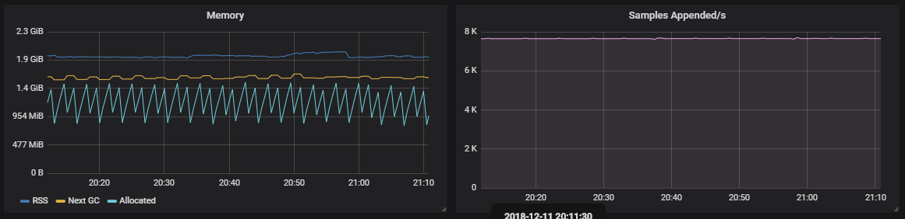
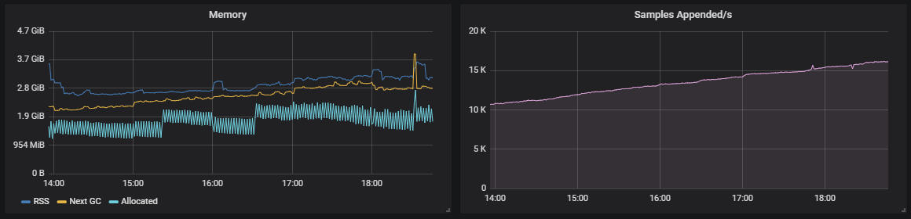

# Prometheus

We use a [Prometheus](https://prometheus.io/), [Alertmanager](https://prometheus.io/docs/alerting/alertmanager/) and [Grafana](https://grafana.com/) stack for a complete monitoring setup of both our clusters and applications running on them.

- Prometheus does the _service monitoring_ and keeps time-series data.
- Alertmanager is responsible for handling alerts, based on _rules_ from Prometheus. In our case Alertmanager is responsible for making sure alerts end up in [Opsgenie](https://www.opsgenie.com/) and Slack.
- Grafana provides nice charts and dashboards of the Prometheus time-series data.

## Recommendations and best practices

### Prometheus labels

As the [Prometheus documentation](https://prometheus.io/docs/practices/naming/#labels) states:

> Use labels to differentiate the characteristics of the thing that is being measured:
>
> - api_http_requests_total - differentiate request types: type="create|update|delete"
> - api_request_duration_seconds - differentiate request stages: stage="extract|transform|load"

It's **important** to note the CAUTION box in the documentation, that states:

> CAUTION: Remember that every unique combination of key-value label pairs represents a new time series, which can dramatically increase the amount of data stored. Do not use labels to store dimensions with high cardinality (many different label values), such as user IDs, email addresses, or other unbounded sets of values.

Not following that advise can cause the whole Prometheus setup to become unstable, go out of memory and eventually cause collateral damage on the node that's running on. A good example can be found in [this Github issue](https://github.com/prometheus/client_golang/issues/491).

This is how Prometheus would perform with "controlled" metric labels:



Vs. a Prometheus with "uncontrolled" metric labels:



## Prometheus scrapers for common technologies

Here's a list of Prometheus scrapers already available for common frameworks.

NOTE:

- For k8s clusters, once your application's metrics are exposed you'll need to create a `ServiceMonitor` to scrape them. Head to the [k8s specific documentation](../kubernetes/monitoring.md) for more information.
- For ECS users we'll update the task definition with the required configuration (sidecar container, additional ports) and expose the metrics through the ALB.

### PHP

#### Native

Prometheus has a [native client library](https://github.com/Jimdo/prometheus_client_php) for PHP. This is easy to implement inside your application, but by default doesn't expose standard metrics. This is ideal if you want to expose your own metrics (can also be business metrics).

#### PHP-FPM

If you want to get PHP-FPM metrics, we recommend using [this exporter](https://github.com/hipages/php-fpm_exporter). It's being actively maintained and the documentation is reasonably good. You have to setup the exporter as a sidecar container in your pods/task-definition, then it'll access the PHP-FPM socket to read statistics and expose them as Prometheus metrics.

You first need to expose the metrics in PHP-FPM. You can do this by adding the following config to your PHP-FPM image.

```ini
pm.status_path = /status
```

Then you'll need to add the `php-fpm-exporter` as a sidecar container to your pod/task-definition.

Here is an example for **k8s**:

```yaml
- name: {{ template "app.fullname" . }}-fpm-exporter
  image: "hipages/php-fpm_exporter:0.5.2"
  command: ["--phpfpm.scrape-uri", "tcp://127.0.0.1:{{ .Values.app.port }}/status"]
  ports:
    - name: prom
      containerPort: 9253
      protocol: TCP
  livenessProbe:
    tcpSocket:
      port: prom
    initialDelaySeconds: 10
    periodSeconds: 5
  readinessProbe:
    tcpSocket:
      port: prom
    initialDelaySeconds: 10
    timeoutSeconds: 5
```

*Note that you'll need to adjust `{{ template "app.fullname" . }}` and `{{ .Values.app.port }}` to the correct helm variables. The first one represents the app name we want to monitor. The second is the php-fpm port of the application.*

### Ruby

#### Native

Prometheus has a [native client library](https://github.com/prometheus/client_ruby) for Ruby. This is a really good library when you run your ruby application as single process. Unfortunately a lot of applications use Unicorn or another multi-process integration. When using a multi-process Ruby you can best use the [fork](https://gitlab.com/gitlab-org/prometheus-client-mmap) of GitLab.

You have to integrate this library in your application and expose it as an endpoint. Once that is done, you can add a `ServiceMonitor` to scrape it.

#### Workers

Workers by default don't expose a webserver to scrape from. This will have to change and every worker will need to expose a simple webserver so that Prometheus can scrape its metrics.

It is really discouraged to use Pushgateway for this. For more info why this is discouraged, see the [Pushgateway documentation](https://prometheus.io/docs/practices/pushing/#should-i-be-using-the-pushgateway).

### Nginx

Nginx has an exporter through the [Nginx VTS module](https://github.com/vozlt/nginx-module-vts). We [forked](https://github.com/skyscrapers/docker-images/tree/master/nginx) the official Docker Nginx image and added the VTS module to nginx. We had to fork it because the VTS module needs to be compiled with Nginx.

#### Setup

1. Use our [Nginx](https://hub.docker.com/r/skyscrapers/nginx/) Docker image instead of the upstream Nginx.
2. Add the [exporter](https://github.com/hnlq715/nginx-vts-exporter) as sidecar to the pod/task-definition.

Example for **k8s**:

```yaml
- name: {{ template "app.fullname" . }}-exporter
  image: "sophos/nginx-vts-exporter:v0.10.0"
  env:
    - name: NGINX_STATUS
      value: http://localhost:9999/status/format/json
  ports:
    - name: prom
      containerPort: 9913
```

*Note that you will need to adjust `{{ template "app.fullname" . }}` to the correct helm variables. It represents the app name you want to monitor.*
